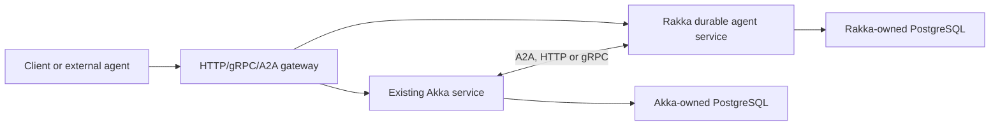

# Rakka and Akka Technical Comparison

- Status: research evaluation
- Evaluation date: 2026-07-09
- Rakka snapshot: `6b6f8a13bc0eeee7256d198a85ef0d6b26ec0244`
  (2026-07-09)
- Akka documentation snapshot: retrieved 2026-07-09
- Current Akka SDK release documented at evaluation time: `3.6.0`
- Akka CLI release documented at evaluation time: `3.0.62`
- Akka core documentation line reviewed: `2.10.20`; some current-documentation
  banners still identified `2.10.19`, so exact library artifacts should be
  pinned from the selected Akka release BOM

## Purpose

Rakka began as a Rust alternative to Akka. This document compares the current
Rakka workspace with both layers of modern Akka:

1. **Akka Libraries**: actors, cluster, remoting, sharding, persistence,
   reliable delivery, streams, projections, management, and Kubernetes
   operation; and
2. **Akka SDK**: entities, workflows, request-based agents, the newer durable
   `AutonomousAgent`, task coordination, memory, endpoints, tools, guardrails,
   and managed operations.

The evaluation focuses on the same topics as the other framework comparisons:

- multi-node clustering and agent-to-agent communication;
- orchestration, reliability, and durability;
- workflow semantics;
- enterprise and Kubernetes readiness;
- portability and migration;
- agent persistence and memory; and
- opportunities for a distributed cluster of autonomous agents.

It also distinguishes **implemented Rakka behavior** from the planned
`rakka-agent` direction under [`docs/plans/rakka-agent`](../../plans/rakka-agent/).
That distinction is essential: Rakka already has a substantial durable agent
workflow and A2A substrate, but it does not yet have the first-class model-driven
agent component that Akka SDK 3.6 now exposes.

## Executive Summary

Akka is the mature reference implementation and currently has the broader,
more integrated platform.

- Akka Libraries provide a deeply proven actor, cluster, sharding, persistence,
  streams, reliable-delivery, projections, management, security, and rolling
  upgrade ecosystem.
- Akka SDK turns those foundations into higher-level components: event-sourced
  and key-value entities, durable workflows, endpoints, consumers, timers,
  request-based agents, durable session memory, and—since May 2026—durable
  autonomous agents.
- Akka `AutonomousAgent` is already a product-level abstraction. It supplies
  typed tasks and results, persisted agent/task state, crash recovery,
  iteration limits, tools, MCP, guardrails, task dependencies, human-driven
  tasks, dynamic setup, attachments, queryable lifecycle state, and four
  built-in multi-agent patterns: delegation, handoff, teams, and moderation.

Rakka has reached meaningful parity at the distributed execution substrate,
but not at Akka's maturity or breadth.

- Rakka implements typed actors, supervision, receptionist/routers, bounded
  remoting, membership, sharding, passivation, event sourcing, durable state,
  PostgreSQL stores, workflow inbox/outbox, a compiled graph scheduler,
  durable effects, human checkpoints, timers, query/audit/telemetry surfaces,
  Kubernetes drain/readiness, and a durable A2A adapter.
- `rakka-agent-workflow` already provides more than a plan: the compiled graph,
  effect bridge, dispatcher fleet, recovery, failure injection, A2A peer
  effects, and operational surfaces are implemented and tested.
- Rakka does **not** yet provide a first-class `Agent` or `AutonomousAgent`
  developer API, a model-driven loop, Rig provider integration, typed agent
  tasks, session-memory implementation, an agent registry, built-in
  delegation/handoff/team/moderation capabilities, MCP integration, model
  guardrails, or an agent testkit at Akka's level. Those capabilities are
  described in the current `rakka-agent` planning draft, not shipped code.

The central conclusion is:

> Akka is currently the stronger end-to-end platform and the clearest product
> benchmark. Rakka's opportunity is to deliver a Rust-native, inspectable,
> product-neutral alternative whose durability and effect-safety contracts are
> more explicit than Akka's high-level abstraction.

Rakka should learn from Akka's component model rather than reproduce its JVM
implementation. The most valuable near-term target is a first-class
`rakka-agent` crate that combines Akka-like ergonomics with Rakka's existing
durable run, compiled graph, A2A, and effect infrastructure.

## Product and Licensing Baseline

### Akka

Akka is a commercial, supported platform with more than a decade of production
history in its actor and distributed-systems foundation. Akka core documentation
identifies the libraries as supported since 2012. Akka now offers:

- self-managed Akka Libraries and Akka SDK deployments;
- Akka Automated Operations in Akka's serverless cloud or a customer's VPC;
- commercial production support, managed upgrades, observability, elasticity,
  multi-region operation, and persistence oversight; and
- public documentation, samples, API references, and testkits.

Akka Libraries and Akka SDK are distributed under Business Source License 1.1.
Akka permits free use for qualifying open-source, academic, startup, and
pre-production scenarios, while general production use requires a commercial
license. Artifacts are obtained through Akka's tokenized repository and
self-managed services require an Akka license key.

The actor/cluster foundation is mature. The `AutonomousAgent` component itself
is new: Akka's release notes introduced it in May 2026. Enterprise platform
maturity should therefore not be confused with years of production evidence
for this specific agent component.

### Rakka

Rakka identifies itself as a v1 release-candidate foundation and workspace
version `0.1.0`. The repository contains strong implementation, test, failure
injection, compatibility, and operations work, but it has not accumulated
Akka's adoption, integration ecosystem, or long-term production evidence.

Rakka's release licensing must also be resolved. The current repository
`LICENSE` file is an all-rights-reserved/confidential notice, while the known
limitations document says the repository does not yet declare a release
license. Public distribution, external contributions, artifact publishing, and
commercial terms should be clarified before positioning Rakka as an available
alternative to Akka.

## Architectural Comparison

| Area | Modern Akka | Rakka today | Rakka direction |
| --- | --- | --- | --- |
| Language/runtime | Java/Scala on JVM; SDK API primarily Java | Rust 2021 on Tokio | Rust-native throughout; Rig behind adapters |
| Actor API | Mature Classic and Typed actors | Typed actors and Akka-shaped facade | Stabilize facade and close operational gaps |
| Supervision | Mature typed/classic strategies and DeathWatch | Supervision, watch, dead letters, lifecycle | Preserve explicit typed errors and bounded execution |
| Cluster | Gossip membership, failure detection, SBR, roles, singleton, sharding | Membership/discovery, known-peer remoting, sharding | Strong external arbiter plus peer self-fencing |
| Remoting | Artery TCP/TLS or Aeron, mature tuning and protocol evolution | Bounded TCP/Protobuf known-peer transport | TLS/mTLS integration and broader soak testing |
| Sharding | Mature coordinator, DData/event-sourced metadata, leases, rebalancing, passivation | Stable identities, local/remote routes, PostgreSQL ownership, passivation/handoff | Harden distributed acknowledgement and external-arbiter fencing |
| Persistence | Event sourcing, durable state, multiple mature plugins | Event sourcing/durable state, in-memory and PostgreSQL | More stores, migrations, operational tooling |
| Reliable delivery | Optional durable producer queues and at-least-once delivery | Durable workflow inbox/outbox | Keep correctness separate from core remoting |
| Streams | Full Reactive Streams graph DSL and integrations | Intentionally small bounded Source/Flow/Sink facade | Expand selectively without losing boundedness |
| Workflow | SDK code-first durable step state machine | Durable inbox/outbox plus compiled graph scheduler | Product-neutral compiled plans and workflow-as-tool |
| Request agent | First-class `Agent` effect component | Model/tool adapter traits only | Rig-backed request/turn API |
| Autonomous agent | First-class durable `AutonomousAgent` | Not implemented | Planned durable sharded `rakka-agent` |
| Multi-agent patterns | Delegation, handoff, teams, moderation | A2A peer effect plus graph fan-out/fan-in | First-class capability descriptors over A2A/graph execution |
| Agent memory | Event-sourced session memory, filtering, compaction, custom providers | No agent-domain memory implementation | Session, private, and communal memory traits |
| Public agent protocols | A2A, ACP, MCP clients; MCP/HTTP/gRPC endpoints | Durable A2A server/adapter; HTTP/gRPC foundations | Add outbound protocol adapters and MCP |
| Guardrails | Runtime-configured model/MCP request/response guardrails | Autonomy policy and security boundaries, no model guardrail engine | Mandatory dispatch-time policy and guardrail chain |
| Kubernetes | Self-managed guides plus mature management; optional AAO | Reference manifests, probes, drain, snapshots | Helm/operator and production deployment profile |
| Multi-region | AAO replication and routing | Not provided | Future; do not imply from single-region clustering |
| Commercial maturity | Established support and operations product | Release candidate | Requires license, releases, adoption, and production proof |

## 1. Actor Model and Local Runtime

### Where Rakka Follows Akka

Rakka deliberately uses Akka-shaped concepts:

- `ActorSystem`, typed `ActorRef`, and logical actor paths;
- message-at-a-time handling;
- parent/child lifecycle and watching;
- supervision and dead-letter visibility;
- `ask`, `pipe_to_self`, timers, and setup behavior;
- receptionist-backed service discovery;
- pool and group routers;
- event-sourced and durable-state behaviors; and
- Source/Flow/Sink stream vocabulary.

The facade and migration notes make this lineage explicit. For a Rust user who
already understands Akka Typed, Rakka's conceptual model is intentionally
familiar.

### Where Akka Remains Ahead

Akka's local runtime has substantially more maturity and surface area:

- more supervision, stash, mailbox, dispatcher, scheduling, routing, and
  lifecycle options;
- a long-tested serialization and schema-evolution ecosystem;
- a complete Reactive Streams implementation and graph DSL;
- mature HTTP, gRPC, projections, Kafka, Alpakka, diagnostics, and management
  integrations;
- synchronous and asynchronous testkits across Java and Scala; and
- extensive performance tuning and production diagnostics.

Rakka's bounded mailboxes and smaller API are a useful Rust-native foundation,
not parity with the full Akka runtime. Rakka should avoid copying every Akka
feature. It should prioritize the subset required for durable entity, workflow,
and agent execution.

## 2. Akka Cluster Versus a Rakka Multi-Node Cluster

### Akka Cluster

Akka Cluster and Cluster Sharding provide a mature distributed runtime:

- cluster membership and reachability;
- failure detection and Split Brain Resolver strategies;
- roles and minimum-member startup constraints;
- cluster singletons;
- distributed receptionist and group routing;
- logical sharded entities independent of node location;
- configurable shard allocation and rebalancing;
- passivation and remembered entities;
- DData or event-sourced shard metadata;
- optional leases as a final single-owner guard;
- coordinated shutdown and graceful shard/singleton movement;
- Kubernetes bootstrap and pod-deletion-cost support; and
- rolling-upgrade rules for remoting, serialization, persisted data, and
  sharding configuration.

Ordinary actor and sharding messages remain best effort and at-most-once.
Akka's Reliable Delivery can add at-least-once behavior; a durable producer
queue is required if unconfirmed messages must survive producer failure.

### Rakka Cluster

Rakka currently provides:

- explicit cluster membership and compatibility admission;
- known-peer bounded TCP/Protobuf remoting;
- typed codec registration and fail-closed envelope decoding;
- receptionist propagation and remote service proxies;
- sharded entity identity, local/remote routing, passivation, and handoff;
- remembered entities;
- PostgreSQL coordinator state, leases, and revision fencing;
- deterministic allocation from an externally supplied membership set;
- optional etcd discovery/lease integration; and
- Kubernetes readiness/drain and operational snapshots.

Rakka makes a different coordination choice. It does not attempt to reproduce
Akka's gossip membership and Split Brain Resolver. Its intended symmetric
cluster design uses a strongly consistent external arbiter, such as etcd, as
the authoritative membership set. Ownership is a deterministic function of
that set, with durable compare-and-set state providing stale-writer rejection.

This can be a good Kubernetes-oriented design, but it is less self-contained
than Akka and still has an explicitly documented peer-reachability gap: a node
can retain its external lease while becoming unreachable to peers. Rakka's
planned self-fencing behavior must be implemented and failure-tested before
claiming partition-safe equivalence.

### Direct Assessment

| Question | Assessment |
| --- | --- |
| Can both distribute actors/entities across machines? | Yes. |
| Is Rakka clustering a one-to-one Akka implementation? | No; APIs are inspired by Akka, but coordination design differs. |
| Which has the more mature failure model? | Akka. |
| Which has the simpler explicit persistence boundary? | Rakka is more opinionated about CAS plus durable inbox/outbox. |
| Which handles arbitrary infrastructure more independently? | Akka, because its cluster membership and SBR are internal. |
| Which deliberately leans into Kubernetes/external consistency? | Rakka. |
| Are ordinary messages durable in either framework? | No; stronger delivery is opt-in. |

Rakka should retain the external-arbiter design if it is a product goal, but
must document it as a deliberate alternative to Akka Cluster—not as completed
Akka parity.

## 3. Orchestration, Reliability, and Durability

There are three different Akka orchestration layers to compare.

### Akka Actor/Entity Orchestration

Typed actors serialize local state transitions. Cluster Sharding gives one
active entity location and transparently routes commands to it. Persistence
reconstructs entity state after a crash or move. This is the direct ancestor
of Rakka's actor, persistence, and sharding model.

### Akka SDK Component Runtime

Akka SDK hides most actor mechanics behind components and `ComponentClient`:

- stateful component instances are sharded across service instances;
- only one instance of a given entity/workflow ID is active in a service
  cluster;
- state stays in memory while active and is recovered after passivation,
  rebalance, rolling update, or crash;
- declarative `Effect` values tell the runtime what state transition and reply
  to perform; and
- PostgreSQL supplies self-managed persistence.

This is a higher-level product experience than Rakka currently exposes. Rakka
users still wire actors, stores, sharding, runtime actors, dispatchers, and
adapters more explicitly.

### Akka Autonomous-Agent Orchestration

Akka's autonomous-agent runtime adds:

- a durable agent instance ID and typed task IDs;
- persisted task and agent state;
- one active task per agent instance with a durable pending queue;
- a model decision loop bounded by iteration policy;
- structured task results and result validation;
- suspend, resume, terminate, query, and notifications;
- task dependencies and automatic cancellation after dependency failure;
- runtime-mediated worker delegation and coordination; and
- recovery after crashes and restarts.

This is the closest equivalent to Rakka's planned `AgentEntity` plus
`AgentTaskEntity`/`AgentRunEntity` domain, not to `rakka-core` alone.

### Rakka Agent-Workflow Orchestration

Rakka currently supplies the lower-level execution kernel:

- durable command acceptance through a deduplicating inbox;
- durable model/tool/A2A effect scheduling through an outbox;
- explicit dispatch claims, leases, attempts, retries, and result acceptance;
- a versioned compiled execution plan;
- deterministic graph scheduling with branches, joins, fan-out/fan-in, and
  bounded iterators;
- human checkpoints and durable timers;
- stable sharded run ownership and passivation;
- recovery after command, schedule, callback, timer, and ownership failures;
- logical credential binding references resolved only at dispatch;
- query indexes, audit records, runtime events, snapshots, metrics, and OTLP
  bridge models; and
- a public A2A adapter that acknowledges only after durable acceptance.

What it lacks is the opinionated loop that turns a model decision into the next
small durable transition.

### Is It a One-to-One Comparison?

No.

| Akka capability | Closest Rakka surface | Current relationship |
| --- | --- | --- |
| Akka Typed actor | `rakka-core` actor/behavior | Direct conceptual equivalent |
| Cluster Sharding entity | `rakka-sharding` entity | Direct conceptual equivalent, different coordination strategy |
| Event Sourced Entity | `rakka-persistence` behavior | Direct conceptual equivalent |
| SDK Workflow | `rakka-agent-workflow` runtime/runner | Overlapping durable orchestration |
| SDK Workflow step retry | `rakka-workflow` outbox/effect bridge | Rakka exposes more delivery bookkeeping |
| Request-based Agent | Model adapter plus application code | Missing first-class component |
| Autonomous Agent | Planned `rakka-agent` agent/task/run domain | Not implemented |
| Task entity | Planned `AgentTaskEntity` plus A2A task projection | Stable typed task identity is distinct from per-agent execution runs |
| ComponentClient | Facade/entity/A2A/application adapters | No single unified client yet |
| Agent notifications | Runtime events and A2A event replay | Rakka has a stronger replayable direction |

### External Effects

Akka Workflow documentation explicitly warns that a failed step may be
re-executed and that non-idempotent calls can therefore be repeated. Akka
Reliable Delivery likewise documents at-least-once redelivery after crash
boundaries.

The autonomous-agent documentation promises persistence, retry, recovery, and
audit, but the public documentation reviewed does not establish atomic
exactly-once semantics for arbitrary model, MCP, or function-tool side effects.
The safe interpretation is the same as Rakka's: external actions require
idempotency, deduplication, or reconciliation.

Rakka is unusually explicit here. Its current effect bridge is at-least-once,
and its planned agent contract says an ambiguous non-idempotent effect should
become `Indeterminate` and stop autonomous retry until reconciled. That is a
strong differentiator if implemented end to end.

## 4. Workflow Comparison

### Akka SDK Workflow

Akka Workflow is a code-first durable state machine:

- each workflow has a stable ID and one active owner;
- public command handlers return an `Effect`;
- step methods return a `StepEffect`;
- state and the current transition are durable;
- failed steps retry under a recovery strategy;
- timeouts and failover handlers are configurable;
- a workflow can pause for human/external input and resume later;
- terminating a workflow stops future execution and passivates it; and
- workflows can invoke Agents, Autonomous Agents, entities, external services,
  and other components.

Akka's API is concise and highly approachable. It is particularly strong for
business processes expressed as Java methods and explicit next-step
transitions.

### Rakka Compiled Workflow

Rakka's compiled execution layer is product-neutral and data driven:

- immutable versioned plan/IR with fingerprints;
- statically validated node and edge contracts;
- durable per-node graph state;
- deterministic ready-set computation;
- branch selection and optional paths;
- all/any joins;
- parallel fan-out/fan-in;
- bounded iterator loops;
- model, tool, A2A, timer, human, and child-workflow node targets;
- effect intent separated from dispatch;
- logical credentials rather than resolved secrets; and
- recovery that reconstructs runnable work from durable graph state.

This design is better suited to an external workflow editor/compiler, plan
versioning, deployment artifacts, and static policy validation. Akka's public
SDK Workflow is easier to author directly in application code.

### Practical Comparison

| Concern | Akka Workflow | Rakka compiled workflow |
| --- | --- | --- |
| Authoring | Java class and methods | Versioned data/IR produced by code or compiler |
| Primary shape | Durable step state machine | Durable graph scheduler |
| Developer ergonomics | Strong and concise | Lower-level today |
| Branching | Programmatic transitions | Explicit graph edges |
| Parallel graph work | Possible through component calls/patterns, but not the primary step model | First-class fan-out/fan-in and joins |
| Human wait | Pause and command resume | Durable human checkpoint node/runtime |
| Retry | Recovery strategy per workflow/step | Per-effect durable outbox/dispatcher policy |
| Effect bookkeeping | Mostly runtime-managed | Public, queryable effect intent/attempt/result state |
| Static plan validation | Java type checking plus runtime component validation | Explicit schema, graph, secret, cycle, and compatibility validation |
| Visual/compiler backend | Requires application tooling | Explicit design goal |
| External side effects | May repeat; idempotency required | At-least-once; idempotency/reconciliation required |

The right Rakka direction is not to replace the compiled graph with an
Akka-shaped method workflow. Add a small ergonomic code-first builder that
compiles into the same IR.

## 5. Akka's New Agentic Capabilities

### Request-Based `Agent`

Akka's existing `Agent` component handles a single well-defined model task. A
command returns a declarative agent `Effect` containing model, system/user
messages, memory policy, tools, response transformation, and failure handling.
It supports streaming and session-based collaboration.

Model integrations include hosted and local providers such as Anthropic,
OpenAI/Azure OpenAI, Bedrock, Gemini/Vertex AI, Hugging Face, Ollama, and
LocalAI, with a custom LangChain4j provider escape hatch.

### Durable `AutonomousAgent`

Akka SDK 3.6's `AutonomousAgent` is a separate component for model-driven,
multi-step work. Its definition declares:

- a mandatory outcome-oriented description;
- accepted typed task definitions;
- expected typed result schemas;
- function tools, Akka component tools, and remote MCP tools;
- request and response guardrails;
- model provider and instructions;
- maximum iterations per task;
- optional dynamic per-instance instructions and capabilities;
- content loaders and attachment support; and
- coordination capabilities.

The runtime persists agent and task state, drives the model loop, queues tasks,
handles dependencies, exposes state/result queries, and recovers interrupted
work. Notifications cover lifecycle, tasks, teams, dependencies, approaching
iteration limits, and struggle signals.

Notifications are explicitly an observability surface, not correctness state.
They are live and non-replayable; clients must query durable task/agent state
after a gap. This matches Rakka's principle that runtime events are projections,
although Rakka's A2A event store already supports bounded durable replay with
gap detection.

### Built-In Coordination Patterns

Akka supplies four model-facing capabilities:

1. **Handoff** transfers a task to an allowed target agent.
2. **Delegation** fans work out to specialist agents and brings results back to
   the coordinator, with bounded parallel workers.
3. **Team leadership** creates a shared task list whose peer members claim work
   and message each other.
4. **Moderation** controls turn-taking among agents for reviews, negotiations,
   and debates, with bounded rounds/iterations.

The runtime creates the coordination tools from these declarations. Application
code does not implement ad hoc HTTP calls between agents. Akka explicitly
recommends platform-mediated coordination and warns that direct Agent-to-Agent
HTTP/A2A/MCP calls can bypass durability and audit.

### Tasks and Human Input

Akka tasks are first-class, typed, and independently queryable. They support:

- stable identity and lifecycle status;
- typed instructions and typed results;
- result validation rules;
- dependency task IDs;
- attachments by URI/object reference;
- assignment, reassignment, completion, failure, and cancellation;
- human-owned tasks and approval gates; and
- automatic unblocking or cancellation of dependents.

This is a major product-level gap for Rakka. Rakka has durable run identity,
human checkpoints, graph nodes, and A2A tasks, but no equally cohesive
application-facing typed task API.

### Memory and Knowledge

Akka session memory is:

- automatically used by request-based agents;
- identified by session ID and shareable between agents;
- persisted as an event-sourced entity;
- configurable as none, limited-window, read-only, write-only, or filtered;
- interceptable before persistence for sanitization;
- compactable through application/LLM logic;
- accessible through `ComponentClient` and event streams; and
- replaceable with a custom provider.

Akka models long-term/shared memory with ordinary Event Sourced or Key Value
Entities. Semantic RAG uses LangChain4j and external vector databases through
Java clients rather than one mandatory vector backend.

### Guardrails and Governance

Akka guardrails can be configured at deployment for model and MCP request and
response boundaries. They can block or report, select agents by ID/role, and
emit auditable logs, metrics, and traces. HTTP/MCP endpoints also have deny-by-
default ACLs and JWT integration, although Akka's MCP endpoint documentation
states that MCP OAuth 2.1 flows are not yet supported.

Rakka has strong low-level policy concepts—autonomy policy, logical credential
bindings, secret exclusion, audit records, bounded metrics—but does not yet
have an equivalent runtime guardrail chain around model and MCP content.

## 6. Where Rakka Is Headed Relative to Akka

The current `rakka-agent` planning draft converges on many of the same product
concepts, but with a more explicit distributed-correctness model.

### Planned Rakka Agent Model

The draft introduces:

- stable `(TenantId, AgentId)` logical agents;
- distinct `AgentGoalId`, `AgentTaskId`, and `AgentRunId` identities;
- independently sharded and recoverable run entities;
- a durable loop split into bounded decision/effect/result transitions;
- Rig for model/provider/tool representation;
- durable A2A delegation with lineage, fan-out, budgets, and cycle prevention;
- workflows exposed as durable tools;
- versioned settings revisions and dispatch-time safety checks;
- finite and continuous goals with evidence-based terminal authority;
- session, agent-private, and communal knowledge scopes;
- durable human, authorization, and reconciliation waits; and
- passivation whenever the agent is waiting on the world.

The guiding invariant is stronger and clearer than the typical "always-on
agent" description:

> Always-on means logically addressable and recoverable, not a resident actor,
> thread, future, stream, process, connection, or pod.

### Capability Gap Matrix

| Agent capability | Akka SDK 3.6 | Rakka implemented | Rakka plan |
| --- | --- | --- | --- |
| Request-based model agent | Yes | Adapter traits only | Yes, via Rig-backed turn execution |
| Durable autonomous loop | Yes | No | Yes |
| Typed task definitions/results | Yes | A2A/run contracts, not a first-class typed task API | `AgentTaskId`/`AgentTaskEntity` plus typed definitions/results |
| Task dependencies | Yes | Compiled graph edges | Yes, task/delegation plus graph relationships |
| Durable task/agent state | Yes | Durable run state and A2A projection | Extend to agent/goal/task/run domain |
| Delegation | Built in | A2A peer effect | First-class durable delegation |
| Handoff | Built in | Can be modeled in graph/A2A | First-class capability needed |
| Team/shared backlog | Built in | No agent team abstraction | Planned collaborative goal/knowledge model; backlog API needed |
| Moderated conversation | Built in | No | Capability/runtime design needed |
| Human approval | Task/external input and Workflow pause | Durable human checkpoints | Extend to typed task/authorization states |
| Iteration budgets | Built in | Generic autonomy policy/budgets | Agent-loop budgets planned |
| Token/cost/delegation budgets | Token state and iteration controls | Generic usage/autonomy policy | Rich multi-dimensional budgets planned |
| Model providers | Nine plus custom LangChain4j | None | Rig providers |
| Function tools | Yes | Tool adapter traits and process tools | Typed Rig/tool registry |
| MCP client/server | Yes | No MCP adapter | Needed |
| A2A | Client support and platform patterns | Durable server/adapter and peer effect | Expand outbound and interop |
| ACP | Client support | No | Optional after A2A |
| Session memory | Event-sourced and configurable | No agent memory store | Planned |
| Long-term/shared memory | Entities plus external vector stores | Persistence/artifacts, not semantic memory | Private and communal memory traits planned |
| Guardrails | Model/MCP runtime chain | Autonomy policy, no content chain | Needed |
| Attachments | URI/object storage loaders | Artifact references and size policy | Add typed multimodal content loaders |
| Agent registry | Built in | A2A catalog/workflow registry, no agent registry | Needed |
| Notifications | Rich live, non-replayable stream | Runtime events plus durable A2A replay | Preserve replay advantage |
| Testkit | SDK component testkit and samples | Strong workflow/A2A testkit | Add deterministic model/agent-loop testkit |

### Where Rakka Can Be Better

Rakka should not claim superiority before implementation, but its architecture
has several credible differentiators:

1. **Explicit effect intent.** Model, tool, peer, timer, and human boundaries
   are durable records rather than an opaque runtime promise.
2. **Indeterminate effects.** The planned agent can stop after an ambiguous
   non-idempotent outcome instead of blindly retrying.
3. **Product-neutral compiled IR.** Workflows can come from editors, compilers,
   or APIs without coupling correctness to one Java class.
4. **Replayable public task events.** A2A clients can resume from a durable
   cursor and receive explicit resync errors when retention has removed a gap.
5. **Credential-reference discipline.** Resolved secrets are prohibited from
   plans, state, effects, events, logs, metrics, snapshots, and indexes.
6. **Goal identity above one agent.** `AgentGoalId` lets several independently
   durable runs collaborate without pretending one actor instance is the goal.
7. **Passivation by design.** Continuous agents wake for bounded epochs rather
   than requiring a resident polling loop.
8. **Rust deployment profile.** Smaller native binaries, no JVM, and Rust's
   ownership/type system may suit edge, infrastructure, and safety-conscious
   environments.

These are opportunities, not completed product claims.

Akka's public client documentation exposes a specific residency difference:
agents managed through explicit task assignment do not automatically passivate
when their queue drains; they retain in-memory state until termination, while
suspend can release the actor. Rakka deliberately chooses stronger automatic
quiescence: task eligibility and lifecycle stay durable, but every idle
task/run may passivate without an explicit lifecycle command.

## 7. Enterprise and Kubernetes Readiness

### Akka

Akka is enterprise-ready as a distributed platform. Its evidence includes:

- a long-lived production actor/cluster ecosystem;
- documented compatibility and rolling-upgrade procedures;
- mature persistence, projections, streams, HTTP/gRPC, Kafka, and management;
- commercial licensing, support, security advisories, and diagnostics;
- TLS/mTLS remoting, including Kubernetes certificate rotation support;
- Split Brain Resolver, leases, coordinated shutdown, and Kubernetes bootstrap;
- self-managed cloud/on-prem Kubernetes guidance;
- PostgreSQL-backed self-managed SDK persistence;
- Akka Automated Operations for managed elasticity, upgrades, certificates,
  persistence, observability, and multi-region operation; and
- control-tower metrics plus log/metric/trace export, including OTLP.

Self-managed Akka is not zero-operations. The customer remains responsible for
Kubernetes, PostgreSQL, routing, certificates, network policy, service-to-
service access control, backups, resource tuning, and upgrade execution. AAO
addresses much of that for a commercial fee.

The autonomous-agent component deserves a narrower statement: it is
production-shaped and inherits Akka's runtime, but was introduced only in May
2026. Teams should validate model/tool retry behavior, persistence boundaries,
task migration, cost limits, observability, and failure recovery against their
exact SDK release before adopting it for high-impact autonomy.

### Rakka

Rakka is not yet enterprise-ready in the same sense. It has strong engineering
foundations:

- strict Rust lints and documented MSRV;
- broad unit/integration/failure-injection coverage;
- versioned remoting and state contracts;
- N/N+1 compatibility policy;
- PostgreSQL persistence and coordinator adapters;
- durable workflow and A2A recovery tests;
- readiness, liveness, drain, snapshots, metrics, and OTLP-oriented surfaces;
- security-conscious process defaults; and
- reviewable Kubernetes manifests and runbooks.

Material gaps remain:

- no stable public release or resolved distribution license;
- no accumulated production/adoption record;
- no full Kubernetes operator or Helm lifecycle;
- no built-in remoting TLS/mTLS or certificate rotation;
- no internal SBR/consensus and incomplete peer self-fencing;
- fewer persistence and integration backends;
- no managed control plane, multi-region replication, or hosted operations;
- no complete agent runtime, model providers, MCP, memory, or guardrail layer;
- no hosted dashboards or mature diagnostic tooling; and
- limited performance, scale, chaos, and long-duration evidence compared with
  Akka.

### Kubernetes Verdict

| Question | Akka | Rakka |
| --- | --- | --- |
| Can it run multi-node on Kubernetes? | Yes, mature | Yes, foundation/reference topology |
| Automatic cluster bootstrap | Yes | Discovery configuration required; etcd path available |
| Graceful drain/shard movement | Yes | Implemented foundations and tests |
| Split-brain handling | SBR plus optional leases | External arbiter design; peer self-fencing gap remains |
| Remoting mTLS | Built in/configurable | Not built in v1 |
| Operator/Helm | Managed AAO plus mature deployment patterns | Not shipped |
| Multi-region | AAO | Not shipped |
| Production support | Commercial | Not established |
| Agent runtime on Kubernetes | First-class SDK component | Planned |

## 8. Can Akka's Agent Loop or Persistence Be Ported Into Rakka?

### Direct Port

No practical direct port exists.

- Akka SDK is a JVM/Java product built on proprietary/runtime internals and BSL
  licensing.
- Rakka is Rust/Tokio and uses different state, effect, sharding, and async
  abstractions.
- The `AutonomousAgent` public API describes behavior, but the runtime
  implementation is not a Rust crate that can be embedded.
- Copying or translating Akka implementation code would require legal review
  and still produce an expensive, coupled rewrite.

Rakka should perform a clean behavioral implementation based on public
contracts and its own architecture.

### What Can Be Reused Conceptually

The following API concepts are excellent requirements input:

- `AgentDefinition` as the static capability contract;
- outcome-oriented component descriptions;
- typed `TaskDefinition<R>` and typed results;
- task result rules;
- task dependencies and human-owned tasks;
- dynamic per-instance setup;
- one active task per agent instance and parallelism through other instances;
- delegation, handoff, team, and moderation capability descriptors;
- model/tool/guardrail configuration;
- attachments as bounded references rather than inline bytes;
- queryable agent state and token usage; and
- live notifications clearly separated from correctness state.

Rakka should map these concepts onto its own `AgentId`, `AgentGoalId`,
`AgentTaskId`, `AgentRunId`, durable inbox/outbox, compiled graph, artifact,
policy, and A2A contracts. `AgentTaskId` preserves public typed work across
handoff; `AgentRunId` identifies one assignee's isolated execution session.

### Coexistence During Migration

Akka and Rakka can coexist as separate services:



Do not have both runtimes write the same persistence tables. Use explicit
service contracts and migrate state through an export/import or event
translation process.

### Actor/Application Migration

A staged Akka-to-Rakka migration can use these mappings:

| Akka concept | Rakka target | Migration note |
| --- | --- | --- |
| `Behavior<T>` | `Actor`/`Behavior` | Rewrite handlers in Rust; preserve message semantics |
| `ActorRef<T>` | `ActorRef<T>` | Do not persist raw actor paths across runtimes |
| Receptionist `ServiceKey` | Rakka `ServiceKey` | Re-register service contracts |
| Cluster sharded entity ID | Rakka entity ID | Preserve stable domain ID and hash/shard policy intentionally |
| Event Sourced Entity | `EventSourcedBehavior` | Translate event schema; do not share Akka journal internals |
| Durable State Entity | `DurableStateBehavior` | Import state with explicit revision/migration |
| Workflow ID/state | Rakka run/compiled plan state | Create a migration boundary at a safe workflow checkpoint |
| Akka Agent session | Rakka session memory | Export transcript with redaction and stable session ID |
| Autonomous task | Rakka `AgentTaskId`/A2A Task ID | Preserve typed task ID and terminal status; create per-assignee runs |
| Autonomous agent execution | Rakka `AgentRunId` | Preserve agent-scoped session lineage, not Akka runtime internals |
| Component tool | Rakka tool/workflow adapter | Re-expose through a versioned service contract |

Persisted event translation is the hardest part. Use stable Protobuf/JSON
application events where possible, build a one-time importer, verify hashes and
counts, and cut over one entity/task range at a time. Never point Rakka directly
at Akka's internal R2DBC tables and assume schema compatibility.

## 9. High-Value Opportunities for Rakka

### 1. Deliver a First-Class `rakka-agent` Crate

The highest-priority gap is developer experience. A minimal API should include:

- `AgentDefinition` and stable agent metadata;
- typed `TaskDefinition<R>` and result validators;
- `AgentTask`, `AgentGoalSpec`, and stable identity types;
- model, tool, workflow-tool, and peer-agent capability descriptors;
- iteration/token/cost/time/delegation budgets;
- request/response/tool guardrail chains;
- start, assign, query, cancel, suspend, resume, and terminate clients; and
- a deterministic fake-model/tool testkit.

The implementation must compile these ergonomic declarations into existing
Rakka durable state and effects rather than create a second runtime.

### 2. Build the Durable Rig Loop as a State Machine

One bounded activation should:

1. recover run state and current settings revision;
2. load an immutable memory/retrieval snapshot;
3. persist a model effect intent;
4. passivate while the dispatcher invokes Rig;
5. accept and deduplicate the model result;
6. persist tool/delegation intents or a typed terminal proposal;
7. dispatch and accept each result durably; and
8. evaluate goal completion or persist the next wait.

Never execute the full model/tool loop inside one actor handler or one opaque
retryable effect.

### 3. Make Akka's Four Coordination Patterns First-Class

Implement capability descriptors whose runtime representation uses existing
Rakka primitives:

- handoff -> durable task ownership transfer/adoption;
- delegation -> A2A child run plus graph fan-out/fan-in;
- team -> durable shared task board with claim leases and bounded membership;
- moderation -> durable turn schedule, participant state, and round budget.

Every pattern should persist lineage, budgets, cancellation propagation, and
stable child IDs before sending work.

### 4. Add Typed Tasks Above A2A Projections

Rakka's A2A Task is currently a public projection of authoritative run state.
Keep that boundary, but add an application-facing typed task definition with:

- accepted input and result schema references;
- dependencies and cancellation propagation;
- result rules/evidence requirements;
- artifact attachments;
- owner/assignee and authorization state; and
- mapping to A2A task status.

This can match Akka ergonomics without making the public protocol projection
the correctness source.

### 5. Implement Event-Sourced Session Memory

The first memory slice should match Akka's practical features:

- session ID and tenant/agent/run scope;
- event-sourced transcript;
- bounded read windows;
- read-only, write-only, and filtered views;
- stateless sanitization interceptor before write;
- compaction with immutable summary lineage; and
- custom store trait.

Then add Rakka's planned private semantic memory and communal knowledge space
as separate contracts. Do not collapse transcripts, vector facts, shared
claims, and durable run state into one store.

### 6. Turn Policy Into Runtime Guardrails

Extend `AgentAutonomyPolicy` into a dispatch-time chain covering:

- model request/response content;
- function and MCP tool request/response content;
- tenant, agent role, capability, and classification;
- budget, approval, authorization, and credential revision;
- block versus report-only decisions; and
- audit/trace evidence with content redaction.

Configuration should be able to enforce mandatory guardrails regardless of an
individual agent definition.

### 7. Preserve Rakka's Replay Advantage

Akka agent notifications are intentionally non-replayable. Rakka should expose
rich agent-loop notifications through its durable A2A event log and runtime
projection system with:

- monotonic per-run sequence;
- bounded retention;
- reconnect cursor;
- explicit expired-window/resync response;
- tenant-scoped authorization; and
- a clear distinction between projected events and authoritative state.

### 8. Add an Akka-Like Unified Component Client

Rakka's APIs are distributed across actors, entities, workflow facades, A2A,
dispatchers, and stores. A typed `RakkaClient`/`ComponentClient` could unify:

- entity command/query;
- workflow start/query/cancel;
- agent task assignment/query;
- A2A remote invocation;
- streaming event subscription; and
- logical service/catalog lookup.

It should be an adapter over stable contracts, not a global service locator
that hides reliability boundaries.

### 9. Create a Production Kubernetes Package

Rakka needs a Helm chart or operator that wires:

- headless/private remoting discovery;
- etcd or another strongly consistent membership arbiter;
- PostgreSQL persistence and health checks;
- pod identity, readiness, liveness, drain, and PDB;
- NetworkPolicy and mTLS integration;
- compatibility and ownership conditions;
- dispatcher and run-backlog autoscaling signals; and
- OTLP Collector configuration.

The Kaos integration described in the separate comparison is one possible
shortcut for the agent application/control-plane layer.

## Proposed Rakka Target Architecture

```mermaid
flowchart TB
    Ingress["HTTP, gRPC or durable A2A ingress"] --> Client["Rakka component client"]
    Client --> AgentEntity["Sharded AgentEntity\nidentity + settings + policy"]
    Client --> TaskEntity["Sharded AgentTaskEntity\ntyped work + dependencies + assignment + result"]
    TaskEntity --> RunEntity["Sharded AgentRunEntity\nagent-scoped execution + loop state"]

    AgentEntity --> AgentStore["Durable agent state"]
    TaskEntity --> TaskStore["Durable typed task + assignment/result history"]
    RunEntity --> RunStore["Durable run + inbox/outbox + graph state"]
    RunEntity --> Loop["Bounded deterministic loop transition"]
    Loop --> Dispatch["Dispatcher fleet"]

    Dispatch --> Rig["Rig model provider"]
    Dispatch --> Tool["Function / MCP / process tool"]
    Dispatch --> Workflow["Compiled workflow tool"]
    Dispatch --> Peer["Peer agent through A2A"]
    Dispatch --> Memory["Session / private / communal memory"]

    Rig --> Result["Deduplicated durable result acceptance"]
    Tool --> Result
    Workflow --> Result
    Peer --> Result
    Memory --> Result
    Result --> RunEntity
    RunEntity --> Proposal["Typed task-result proposal"]
    Proposal --> TaskEntity

    Policy["Mandatory guardrails + authorization"] -.-> Dispatch
    Events["Replayable task/runtime events"] <-- RunEntity
```

This architecture combines the ergonomics of Akka's component model with the
explicit durability boundaries already present in Rakka.

## Recommended Delivery Sequence

### Phase 1: Request-Based Agent

- Add `rakka-agent` with definition, typed task, model profile, tool registry,
  and guardrail contracts.
- Implement one bounded Rig model turn behind the durable dispatcher.
- Add event-sourced session memory and deterministic fake-provider tests.
- Expose start/query/result through the existing A2A adapter.

### Phase 2: Durable Autonomous Loop

- Implement loop phases and model/tool result transitions.
- Persist after every decision and external effect boundary.
- Add iteration/token/time/cost budgets, suspend/resume/cancel, and evidence-
  based terminal evaluation.
- Test crash injection at every transition.

### Phase 3: Multi-Agent Capabilities

- Add delegation and handoff first.
- Add task dependencies and human-owned tasks.
- Add teams/shared backlog with claim fencing.
- Add moderated conversations with bounded rounds.
- Surface the whole collaboration as durable A2A task lineage.

### Phase 4: Memory, Governance, and Tooling

- Add private semantic and communal knowledge memory traits.
- Add MCP client/server adapters and component/workflow tools.
- Add mandatory deployment guardrails and sanitization.
- Add agent registry, attachment loaders, notification replay, and agent
  testkit.

### Phase 5: Enterprise Operations

- Resolve release licensing and publish a supported compatibility policy.
- Ship Helm/operator packaging, remoting mTLS guidance/implementation, and peer
  self-fencing.
- Run multi-process, Kubernetes, PostgreSQL, chaos, upgrade, soak, performance,
  backup/restore, and security tests.
- Establish production support, release, vulnerability, and migration
  procedures.

## Decision Matrix

| Requirement | Akka | Rakka today | Rakka target |
| --- | --- | --- | --- |
| Mature actor framework | Strong | Functional release candidate | Strong Rust-native subset |
| Mature self-forming cluster | Strong | Partial/different external-arbiter design | Strong Kubernetes-oriented cluster |
| Durable sharded entities | Strong | Implemented foundation | Strong |
| Rich stream ecosystem | Strong | Limited bounded facade | Selective expansion |
| Code-first durable workflows | Strong | Lower-level | Ergonomic builder over compiled IR |
| Compiled graph workflow IR | Not the primary SDK model | Strong | Differentiator |
| First-class request agents | Strong | Missing | Planned |
| Durable autonomous agents | Strong, newly released | Missing | Planned |
| Built-in multi-agent patterns | Four patterns | Primitives only | Planned |
| Durable public A2A task replay | Protocol clients/platform mediation | Strong implemented adapter | Differentiator |
| Session memory | Strong | Missing | Planned |
| Runtime guardrails | Strong | Partial policy substrate | Planned |
| Kubernetes self-management | Mature | Reference foundation | Helm/operator target |
| Managed multi-region operations | Strong commercial option | None | Not near-term |
| Exactly-once arbitrary external effects | No | No | No; idempotency/reconciliation |
| Rust-native runtime | No | Yes | Yes |
| Enterprise production evidence | Strong | Not established | Requires proof |

## Validation Performed

For Rakka snapshot `6b6f8a13bc0eeee7256d198a85ef0d6b26ec0244`:

```text
cargo test -p rakka-agent-workflow -p rakka-a2a --all-features
```

passed all unit, integration, cluster, PostgreSQL-adapter, and documentation
tests selected by those two packages. The run covered, among other areas:

- A2A durable acceptance, deduplication, tenant scoping, replay, push, and
  ownership movement;
- compiled plans and graph scheduling;
- dispatcher claims, retries, and lease recovery;
- effect bridge crash boundaries;
- human checkpoints and timers;
- sharded run passivation and recovery;
- Kubernetes drain/startup contracts;
- migration, retention, audit, metrics, query, and OTLP surfaces; and
- failure injection around inbox, outbox, graph, and callback persistence.

No Akka binaries or clusters were run. Akka SDK runtime implementation source
was not available for direct inspection through the public documentation
surface; Akka findings are based on official documentation, API references,
release notes, pricing/licensing pages, and official samples. Claims about
internal autonomous-agent persistence granularity should be validated with the
exact licensed SDK release during a proof of concept.

No Rakka code behavior changed for this research-only document, so the full
workspace validation and package checks were not run.

## Bottom Line

Akka has evolved from the framework that inspired Rakka into a complete
commercial agentic platform. Its new durable Autonomous Agent closes the gap
between actor infrastructure and a usable multi-agent product API. Today it is
ahead of Rakka in runtime maturity, integrations, developer experience,
Kubernetes operations, security, memory, model/tool support, built-in
coordination, and enterprise evidence.

Rakka is no longer merely an actor experiment, however. Its implemented
durable workflow, compiled graph, dispatcher, A2A, recovery, passivation, and
failure-injection surfaces form a credible distributed correctness kernel.
What is missing is the agent-domain layer that Akka now demonstrates clearly.

The correct strategic goal is:

> Build the Rust-native equivalent of Akka's component and autonomous-agent
> experience on top of Rakka's existing explicit durability substrate—without
> weakening Rakka's boundaries around idempotency, ambiguous effects, secrets,
> replay, typed task/run separation, and logical passivation.

The first meaningful parity milestone is not "all Akka features." It is one
typed Rakka autonomous agent that accepts a durable task, survives model/tool
and pod failures, delegates to a second sharded agent, waits for a human or
workflow, resumes through durable state, exposes replayable A2A progress, and
reaches a policy-evaluated terminal result without hiding an ambiguous external
effect.

## Akka Sources Reviewed

- [Akka documentation](https://doc.akka.io/)
- [Autonomous agents use case](https://doc.akka.io/sdk/use-cases/autonomous-agents.html)
- [Defining an autonomous agent](https://doc.akka.io/sdk/autonomous-agents/defining.html)
- [Autonomous-agent client API](https://doc.akka.io/sdk/autonomous-agents/client.html)
- [Akka SDK public API/Javadocs](https://doc.akka.io/sdk/_attachments/api/)
- [Event-sourced entity API](https://doc.akka.io/sdk/_attachments/api/akka/javasdk/eventsourcedentity/EventSourcedEntity.html)
- [Official Autonomous Agent Playground](https://github.com/akka-samples/autonomous-agent-playground)
- [Multi-agent systems](https://doc.akka.io/sdk/use-cases/multi-agent-systems.html)
- [Agent orchestration](https://doc.akka.io/sdk/agents/orchestrating.html)
- [Request-based agents](https://doc.akka.io/sdk/agents.html)
- [Calling agents](https://doc.akka.io/sdk/agents/calling.html)
- [Agent session memory](https://doc.akka.io/sdk/agents/memory.html)
- [Agent tools](https://doc.akka.io/sdk/agents/extending.html)
- [Agent guardrails](https://doc.akka.io/sdk/agents/guardrails.html)
- [APIs and agent protocols](https://doc.akka.io/sdk/integrations/apis-and-protocols.html)
- [MCP endpoints](https://doc.akka.io/sdk/mcp-endpoints.html)
- [RAG and knowledge](https://doc.akka.io/sdk/use-cases/rag-and-knowledge.html)
- [Akka SDK workflows](https://doc.akka.io/sdk/workflows.html)
- [Akka deployment model](https://doc.akka.io/concepts/deployment-model.html)
- [Self-managed operation](https://doc.akka.io/operations/configuring.html)
- [Operating models](https://doc.akka.io/operations/index.html)
- [Akka release notes](https://doc.akka.io/reference/release-notes.html)
- [Akka pricing and licensing](https://akka.io/pricing)
- [Akka Cluster Sharding concepts](https://doc.akka.io/libraries/akka-core/current/typed/cluster-sharding-concepts.html)
- [Akka reliable delivery](https://doc.akka.io/libraries/akka-core/current/typed/reliable-delivery.html)
- [Akka remoting security](https://doc.akka.io/libraries/akka-core/current/remote-security.html)
- [Akka Management rolling updates](https://doc.akka.io/libraries/akka-management/current/rolling-updates.html)
- [Akka library versions](https://doc.akka.io/libraries/akka-dependencies/current/index.html)
