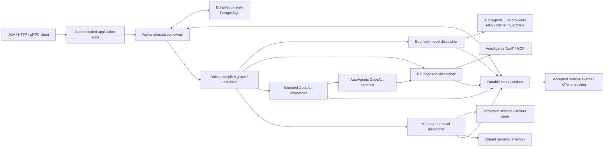

# Rakka and AutoAgents Technical Comparison

- Status: research evaluation
- Evaluation date: 2026-07-09
- Rakka snapshot: `8601fcc68b3f8306237082cdde2808d632650071`
  (2026-07-09)
- AutoAgents snapshot: `7c9d44a9c5f8504c973438ba7979ef0087d8bc49`
  (2026-07-09), workspace version `0.4.0`

## Purpose

This document compares Rakka with
[`liquidos-ai/AutoAgents`](https://github.com/liquidos-ai/AutoAgents), with
emphasis on:

1. AutoAgents' actor runtime and protocol versus Rakka multi-node clustering;
2. orchestration, reliability, and durability;
3. workflow semantics;
4. enterprise and Kubernetes readiness;
5. integrating AutoAgents executors and agent loops with Rakka;
6. integrating AutoAgents memory and Qdrant support with a multi-node Rakka
   cluster; and
7. opportunities for a distributed cluster of autonomous agents.

The assessment distinguishes the capabilities of an embeddable agent SDK from
those of a distributed control plane. It is based on the exact source snapshots
above, the public documentation, and a focused test run. AutoAgents is evolving
quickly; pin and revalidate the exact release selected for an integration.

## Executive Summary

Rakka and AutoAgents are complementary at a clean architectural seam.

- AutoAgents is a mature, modular agent SDK. It supplies typed agent
  definitions, Basic/ReAct/CodeAct executors, a reusable turn engine, cloud and
  local model providers, provider retry/cache pipelines, tools, MCP, memory
  interfaces, Qdrant integration, guardrails, sandboxed code execution,
  protocol events, telemetry, Python bindings, and a local actor runtime.
- Rakka is a distributed execution substrate. It supplies typed actors,
  membership, private remoting, logical identity and sharding, ownership
  fencing, revisioned persistence, durable inbox/outbox, deterministic compiled
  graph execution, recovery, and Kubernetes lifecycle behavior.

AutoAgents' actor runtime is not a Rakka-equivalent cluster. Its only provided
transport is local, its topic registry is in memory, and its messages include
process-local `TypeId`, `dyn Any`, and actor references. AutoAgents does not
currently provide node discovery, network remoting, distributed placement,
durable mailboxes, shard ownership, failover, or split-brain protection.

The recommended ownership split is:

> Rakka owns durable task/run identity, placement, workflow state, recovery,
> and effect delivery. AutoAgents supplies model providers, guardrails,
> agent-turn logic, tools, MCP, CodeAct, memory semantics, and telemetry behind
> Rakka dispatcher adapters.

Do not embed an AutoAgents `ActorAgent` inside every Rakka actor. That creates
two actor runtimes without adding distributed correctness. Prefer AutoAgents'
`DirectAgent`, `AgentExecutor`, `TurnEngine`, `LLMProvider`, `ToolT`, and memory
interfaces at the adapter boundary.

The current AutoAgents ReAct and CodeAct loops execute tools before their
results are stored in memory. Protocol events announce requested and completed
tool calls, but events are not a durable intent ledger. A process failure after
an external effect and before state acceptance can repeat the effect. A
production integration should split model and tool work into Rakka durable
effects.

## Version and Maturity Baseline

AutoAgents' workspace manifest identifies version `0.4.0`, Rust edition 2024,
and dual MIT/Apache-2.0 licensing. GitHub identifies `v0.4.0` as the latest
release on 2026-07-08. The reviewed `main` commit is one day newer than the
release and upgrades local inference dependencies.

AutoAgents has stronger release and quality signals than many early agent
frameworks:

- published Rust crates and Python bindings;
- multiple tagged GitHub releases;
- a release checklist and automated crate/Python publishing;
- format, clippy, feature-matrix, multi-OS, WASI, rustdoc, example, and Python
  binding CI;
- extensive unit and integration tests; and
- maintained user documentation and examples.

A focused `cargo test -p autoagents-core` run at the reviewed commit passed 512
tests and its doc tests. Hardware-specific local inference, the full feature
matrix, Python wheels, Qdrant integration, and Kubernetes behavior were not
validated as part of this evaluation.

There is some release-documentation skew: the repository is `0.4.0`, while the
published quick-start page reviewed during this evaluation still references
`0.3.5`. The quick-start also requires Rust 1.91.1 or later. Rakka's MSRV is
1.85, so a direct AutoAgents dependency would currently require either raising
Rakka's MSRV, isolating the integration in a separate service/process, or
pinning an older compatible AutoAgents version.

Rakka's workspace crates remain version `0.1.0` and the repository describes
itself as a v1 release-candidate foundation. AutoAgents is further along as an
agent developer SDK; Rakka is further along in distributed ownership and
durable workflow semantics. Neither is a complete enterprise agent product by
itself.

## Architectural Comparison

| Area | AutoAgents | Rakka |
| --- | --- | --- |
| Primary role | Embeddable agent SDK and local multi-agent runtime | Distributed actor and durable workflow framework |
| Core agent model | Derived typed agents plus Basic, ReAct, and CodeAct executors | Product-neutral model/tool effect contracts and durable run owners |
| Actor model | `ractor`-backed `ActorAgent` with local topics and events | Native actors plus cluster membership, remoting, receptionist, and sharding |
| Transport | Extensible trait; only `LocalTransport` is implemented | Versioned bounded TCP/Protobuf remoting between admitted peers |
| Workflows | Programmatic patterns using topics, hooks, tasks, and event handlers | Durable compiled graph state machine |
| Agent memory | `MemoryProvider`, sliding window, export/preload hooks | Application-owned agent memory; Rakka persistence is correctness state |
| Vector memory | In-memory and Qdrant vector stores | No opinionated vector store; adapters can be invoked as effects |
| Reliability | Local channels, returned errors, provider retries, lifecycle events | Revision fencing, durable inbox/outbox, leases, retries, recovery, sharding |
| Tool execution | Direct `ToolT`, MCP, Wasmtime tools, resource-limited CodeAct | Durable tool effects; application supplies tool implementation and policy |
| Safety | Guardrails, telemetry redaction, WASM/CodeAct isolation mechanisms | Process allowlists and secret-reference discipline; application policy remains external |
| Kubernetes | Embeddable library; no deployable service or Kubernetes assets | Health, readiness, drain, handoff, compatibility, and reference topology |
| Best fit | Defining how agents reason, call tools, and interact | Keeping distributed, long-running agent work owned and recoverable |

## 1. AutoAgents Actor Runtime Versus a Rakka Multi-Node Cluster

The two actor surfaces overlap conceptually, but only Rakka currently supplies
a cluster runtime.

### What AutoAgents Provides

AutoAgents' multi-agent runtime consists of:

- `ActorAgent`, which wraps an agent in a `ractor` actor;
- `Topic<M>`, a typed topic abstraction;
- `SingleThreadedRuntime`, which stores subscriptions and routes events;
- `Environment`, which owns one or more runtimes and their lifecycle;
- `RuntimeManager`, which starts and stops registered runtimes;
- `Transport`, an abstraction over message delivery;
- `LocalTransport`, the only concrete transport in the reviewed source; and
- `autoagents-protocol::Event`, which exposes task, turn, tool, code-execution,
  and stream lifecycle events.

This provides useful in-process collaboration and UI/event streaming. It also
has bounded Tokio channels for internal and external protocol events and
explicit `run`, `wait`, and `shutdown` lifecycle behavior.

It does not currently provide:

- node membership or discovery;
- remote actor addresses;
- a wire protocol for typed pub/sub messages;
- distributed topic or actor registration;
- network reconnect or delivery policy;
- logical agent identity independent of process location;
- distributed placement or rebalancing;
- single-active-owner fencing;
- durable mailboxes or task acceptance;
- state recovery on another node;
- split-brain handling; or
- rolling wire/schema compatibility.

The current transport boundary is not wire-ready. `Transport::send` receives a
local `AnyActor` reference and an `Arc<dyn Any + Send + Sync>`. Topic routing
uses Rust `TypeId`. `Event::PublishMessage` is explicitly skipped by Serde
because it contains these process-local values. A TCP implementation of the
same trait would still need a serializable type registry, remote addressing,
version negotiation, admission, backpressure, retry policy, and ownership
model.

AutoAgents pub/sub is also best-effort. The runtime sends to topic subscribers
sequentially; individual transport failures are logged and the publish handler
continues. The subscription registry and channel contents disappear with the
process. Broadcast-event lag errors are filtered out, which is appropriate for
telemetry but not correctness.

MCP Streamable HTTP and cloud model HTTP traffic are external service calls,
not agent-cluster remoting.

### What Rakka Adds

Rakka provides:

- incarnation-aware cluster membership;
- protocol-compatible admission;
- bounded per-peer remoting queues and versioned Protobuf envelopes;
- receptionist discovery for registered actor services;
- stable sharded entity identities independent of pod location;
- shard allocation, passivation, handoff, and recovery;
- optional PostgreSQL coordinator leases and ownership fencing;
- etcd as a strongly consistent external membership arbiter; and
- readiness/drain behavior coordinated with ownership movement.

See:

- [Rakka reliability boundaries](../../rakka-v1-reliability-boundaries.md)
- [Rakka compatibility policy](../../rakka-compatibility.md)
- [`rakka-sharding-postgres`](../../../crates/rakka-sharding-postgres/src/lib.rs)
- [`rakka-discovery-etcd`](../../../crates/rakka-discovery-etcd/src/lib.rs)

Rakka core remoting remains at-most-once. Durable inbox/outbox and idempotency
must be added when work cannot be lost. Rakka v1 also does not include built-in
TLS/mTLS or certificate lifecycle management; internal remoting must remain on
trusted private infrastructure.

### Should AutoAgents `Transport` Be Implemented on Rakka?

Not as the primary integration.

A local bridge could implement `Transport` and forward messages to local Rakka
actors, but the existing trait cannot represent a remote Rakka destination or
a versioned serializable payload. Extending it enough to support a cluster
would duplicate Rakka remoting, addressing, type registration, and ownership.

Instead:

- use Rakka actor/entity refs and typed messages inside the cluster;
- map AutoAgents `Task` and selected protocol data into explicit versioned
  application contracts;
- invoke AutoAgents executors behind Rakka dispatchers; and
- expose public agents through [`rakka-a2a`](../../../crates/rakka-a2a/src/lib.rs)
  or application HTTP/gRPC adapters.

AutoAgents `Event` values can remain useful as UI/telemetry projections, but
they should be emitted from accepted Rakka state rather than treated as the
state itself.

## 2. Orchestration, Reliability, and Durability

This is not a one-to-one comparison.

AutoAgents orchestration is an embeddable composition of executors, local
actors, hooks, topics, memory, tools, provider pipelines, and protocol events.
Rakka orchestration is distributed ownership plus durable state-machine
execution.

| AutoAgents component | Closest Rakka component | Important difference |
| --- | --- | --- |
| `ActorAgent` | Local Rakka actor | AutoAgents agent handling performs a complete model/tool run inside one actor message |
| `SingleThreadedRuntime` | Local actor system plus receptionist/router | AutoAgents stores topics locally; Rakka can resolve and route across nodes |
| `Environment` | Actor system lifecycle and coordinated shutdown | Rakka lifecycle includes cluster readiness, drain, and ownership handoff |
| `Task`/submission id | Workflow command/run id | Rakka acceptance and state transition can be durable and deduplicated |
| `AgentExecutor` | Agent model/effect adapter | AutoAgents owns live loop semantics; Rakka owns durable transitions |
| `TurnEngine` | Agent workflow step machine | AutoAgents state is live memory; Rakka step state is persisted and recoverable |
| `ToolProcessor` | Tool effect dispatcher | AutoAgents calls tools inline; Rakka records intent before dispatch |
| Protocol `Event` | Runtime event/projection | Both are useful for observation; Rakka explicitly excludes events from correctness |
| `MemoryProvider` | Agent-domain memory effect | It is not a revision-fenced workflow store |
| LLM retry/cache layers | Dispatcher/provider policy | Retries optimize provider calls but do not recover a durable run |

### AutoAgents Agent-Loop Semantics

The ReAct path is well factored:

1. create a `TurnState` with a memory adapter;
2. assemble system, recalled, and user messages;
3. ask an `LLMProvider` for a response;
4. if the model requested tools, execute each `ToolT` sequentially;
5. emit tool lifecycle events;
6. store the tool interaction in memory;
7. continue to the next turn; and
8. return when the model produces a final text response or the turn bound is
   reached.

CodeAct similarly asks the model to produce TypeScript, executes it in a fresh
QuickJS environment, exposes registered tools through bounded bindings, and
records execution metadata. It has configurable source, console, memory,
timeout, total tool-call, and concurrent tool-call limits.

These are stronger agent-loop abstractions than Rakka intentionally provides.
They are still live futures, not durable transitions.

### Critical Effect Window

For ReAct, the order is effectively:

```text
emit ToolCallRequested
        |
        v
execute external ToolT
        |
        v
emit ToolCallCompleted
        |
        v
store tool interaction in MemoryProvider
```

A process failure after the external tool succeeds but before the memory/run
state is durably accepted can cause the call to repeat. Events sent through
Tokio channels do not close that window. Qdrant persistence does not close it
either because vector memory is not transactionally coupled to tool execution.

AutoAgents model-provider retry and cache layers improve transient-call
behavior. They do not create durable task acceptance, attempt state, leases,
callback deduplication, or recovery after pod death.

The ReAct non-streaming path also treats turn-bound exhaustion as success when
any response or tool result has accumulated, returning `done: true`; it only
returns `MaxTurnsExceeded` when nothing accumulated. A Rakka integration should
define explicit completed, partial, exhausted, cancelled, and failed states
rather than infer terminal meaning from output presence.

### Actor Failure and Backpressure Boundary

An AutoAgents `ActorAgent` awaits the entire executor future inside
`Actor::handle`, so that actor processes one submitted task at a time. Task
failures become protocol `TaskError` events and are intentionally not returned
as actor failures, allowing the actor to handle subsequent tasks.

That is a reasonable local service policy, but it means:

- long model/tool calls occupy the actor handler;
- arbitrary `ToolT` calls have no universal timeout;
- task failure does not automatically activate actor supervision; and
- queued tasks and in-memory state are lost on process failure.

Rakka's recommended agent workflow shape keeps actor transitions short. Model,
tool, memory, and artifact I/O execute in bounded dispatcher pools and report
results back through durable callbacks.

### Rakka's Reliability Boundary

Rakka core actors, remoting, and sharding are at-most-once by default. Stronger
behavior is composed explicitly from:

- revision-fenced durable state or event sourcing;
- durable inbox acceptance and deduplication;
- durable outbox intent, leases, retries, and recovery;
- stable effect and idempotency keys;
- fenced sharded ownership; and
- application-level idempotency, reconciliation, or compensation for external
  effects.

Rakka does not promise exactly-once external side effects. The value is an
explicit, testable record of whether an effect was planned, leased, attempted,
completed, accepted, retried, exhausted, or cancelled.

## 3. Workflow Comparison

AutoAgents has multi-agent workflow patterns, but not a durable workflow engine
or declarative graph model in the reviewed source.

Its examples implement:

- chaining through `on_run_complete` hooks that publish the next `Task`;
- parallel fan-out by publishing to several topics and collecting
  `TaskComplete` events in a spawned Tokio task;
- routing through an LLM classifier and Rust `match`;
- planning through sequential planner/executor calls; and
- reflection through bounded generator/critic/refinement loops.

These are useful SDK patterns and demonstrate the flexibility of agents,
topics, hooks, and events. The orchestration state lives in Rust stack frames,
maps, hooks, and channels. Arbitrary Rust hook wiring cannot be inspected or
compiled into a recovery plan.

| Capability | AutoAgents | Rakka |
| --- | --- | --- |
| Authoring | Rust code, agent hooks, topics, event handlers, examples | Versioned compiled product-neutral plan |
| Shapes | Chaining, parallel, routing, planning, reflection | Dependencies, branches, fan-out/fan-in, iterators, waits, timers, cancellation |
| Execution | Live futures and local actor messages | Pure scheduler transitions plus durable effects |
| State | In-memory agent/runtime/application structures | Durable run, node, retry, timer, effect, and checkpoint state |
| Restart recovery | No workflow checkpoint/replay protocol | Recovery across process death, passivation, and shard movement |
| Join semantics | Application event collector | Explicit durable dependency/join state |
| Failure handling | Application code and `TaskError` events | Durable retry, exhaustion, cancellation, and terminal transitions |
| Long waits | Live runtime/task or application persistence | Durable timers and human checkpoints |
| Distribution | One process | Sharded ownership and dispatcher fleets across nodes |
| External effects | Direct agent/tool calls | Intent persisted before dispatch and completion deduplicated |

### Declarative Workflow Opportunity

AutoAgents' current Rust patterns cannot be automatically compiled in general.
A new declarative layer should describe the topology before runtime:

```rust
enum AutoAgentsNode {
    AgentTurn { agent: AgentRef },
    Route { choices: Vec<RouteRef> },
    FanOut { branches: Vec<NodeRef> },
    Join { policy: JoinPolicy },
    Reflect { max_rounds: u32 },
    Tool { tool: ToolRef },
    Wait { signal: SignalRef },
}
```

The application compiler can map that description into Rakka's durable graph
IR:

| AutoAgents pattern | Rakka compiled form |
| --- | --- |
| Chaining hook | Linear dependency edge |
| Topic fan-out | Parallel child nodes |
| Event collector | Durable join with all/quorum/first-success policy |
| LLM router | Durable model effect followed by validated branch |
| Planner | Model effect that returns a bounded validated sub-plan or artifact |
| Reflection | Bounded iterator over generate/critique/refine nodes |
| ReAct turn | Model effect followed by zero or more tool-effect nodes |
| CodeAct execution | Sandboxed code effect with nested tool effects and hard limits |

The compiler must reject cycles where unsupported, unbounded reflection,
unknown agents/tools, ambiguous joins, unbounded fan-out, oversized payloads,
and non-deterministic local transforms. Store logical provider, tool, model, and
credential binding references—not resolved credentials.

See:

- [Rakka agent workflow specification](../../plans/agentic-workflow/agentic-workflow-spec.md)
- [Compiled graph execution specification](../../plans/compiled_execution_with_graph_schdlr/compiled-execution-with-graph-scheduler-spec.md)

## 4. Enterprise and Kubernetes Readiness

### AutoAgents Assessment

AutoAgents describes itself as production-grade. That claim is credible for
some SDK-level concerns, but should not be interpreted as a production-ready
distributed agent platform.

Positive indicators include:

- active versioned releases and publishing automation;
- extensive focused core tests;
- strict format and clippy checks;
- default, full, and no-default feature validation;
- multi-OS, WASI, examples, docs, and Python binding CI;
- typed provider and tool errors;
- request timeout and provider retry/cache layers;
- guardrail policies for block, sanitize, and audit;
- configurable telemetry redaction;
- MCP operation timeouts;
- CodeAct resource limits and execution isolation;
- local/cloud provider abstraction; and
- bounded framework event channels.

Important platform gaps include:

- no distributed runtime or recovery semantics;
- no deployable server/daemon in the core product;
- no authenticated public API, RBAC, tenant admission, quotas, or billing;
- no durable task/run store;
- no shared persistent conversation provider included by default;
- no Kubernetes manifests, Helm chart, operator, probe contract, drain hook,
  PDB, or NetworkPolicy;
- no built-in cluster transport security or credential lifecycle; and
- no delivery-guarantee or rolling-wire-compatibility policy.

The only Dockerfile in the reviewed repository is `test-build.Dockerfile`. It
uses a CUDA development base and compiles selected crates to validate the
build. It is not a minimal, non-root application runtime image and has no
service entry point, health check, or configuration contract.

Security features also require precise boundaries:

- guardrails inspect or sanitize model inputs/outputs; they are not tool
  authorization or tenant isolation;
- CodeAct enforces explicit source, memory, timeout, console, and tool-call
  limits;
- the generic Wasmtime `WasmRuntime` creates a fresh store without host imports,
  but the reviewed implementation does not configure fuel, epoch interruption,
  or a store memory limiter; and
- arbitrary native `ToolT` implementations run with the host process's
  privileges unless the application isolates them.

**Conclusion:** AutoAgents is a strong embeddable agent SDK and can be part of
an enterprise system. It is not itself the enterprise distributed control
plane, persistence system, or Kubernetes application.

### Rakka Assessment

Rakka is more production-shaped for clustered Kubernetes execution:

- health, readiness, drain, and coordinated shutdown surfaces;
- shard handoff, passivation, recovery, and fail-closed compatibility;
- bounded mailboxes, remoting queues, streams, workflows, and dispatchers;
- PostgreSQL persistence and sharding adapters;
- etcd discovery;
- operational metrics and snapshots; and
- a multi-replica Kubernetes reference topology with PDB and security guidance.

See the
[Kubernetes agent workflow topology](../../plans/agentic-workflow/kubernetes-reference-topology.md).

Rakka also has clear v1 limitations: no built-in TLS/mTLS or certificate
lifecycle, Helm/operator, multi-region consensus, turnkey auth/tenant system,
or exactly-once external effects. An application must supply credentials,
provider budgets, prompt/tool policy, user APIs, and product governance.

### Is AutoAgents Suited for Kubernetes?

Yes as an embedded workload component, not as a ready-to-deploy platform.

For cloud-provider agents, package AutoAgents adapters into a Rakka node or a
separate stateless dispatcher service. For local models, use separate
GPU-specific dispatcher deployments with model-cache volumes, warmup-aware
readiness, resource requests/limits, accelerator node selection, and bounded
concurrency. Do not load a large local model into every sharded run owner.

A combined deployment should include:

1. a Rakka node application with health, readiness, drain, metrics, and stable
   configuration;
2. a `rakka-autoagents` Rust adapter or separate service boundary;
3. PostgreSQL for correctness state;
4. etcd or another supported discovery mode;
5. Qdrant only for vector/semantic memory where needed;
6. private remoting protected by network policy and mesh/application TLS;
7. workload identity or a secret manager for provider credentials; and
8. separate bounded dispatcher pools for cloud models, local models, native
   tools, MCP, CodeAct, memory, and artifacts.

## 5. Can AutoAgents Agent Loops Be Ported into Rakka?

Yes. AutoAgents is particularly suitable for integration because its provider,
executor, turn-engine, tool, memory, and event concerns are already separated.
The safest target is an adapter/refactor below `ActorAgent`.

### Option A: Wrap a Complete `DirectAgent` Run

A Rakka dispatcher can call a configured AutoAgents `DirectAgent` for one task
and return the final output as one effect completion.

Use this only when:

- the loop is short and bounded;
- tools are read-only or idempotent;
- retrying the whole run is acceptable;
- intra-loop progress need not survive a process failure; and
- cancellation and timeouts are imposed around the whole call.

This is a practical first milestone and supports AutoAgents Basic, ReAct, and
CodeAct behavior. It does not make the internal tool calls durable.

### Option B: Reuse Providers and Tools as Rakka Effects

This is the simplest production-grade seam:

- implement Rakka model dispatchers with AutoAgents `LLMProvider` and provider
  pipeline layers;
- implement Rakka tool dispatchers with AutoAgents `ToolT`;
- adapt MCP tools through `autoagents-toolkit`;
- use AutoAgents guardrails around model providers;
- execute CodeAct as an explicitly classified sandbox effect; and
- map typed AutoAgents errors into stable Rakka failure categories.

Rakka remains the turn/workflow driver. AutoAgents supplies high-quality
effect implementations.

### Option C: Build a Durable AutoAgents Turn Driver

This is the recommended long-term design. Extract a serializable state machine
from `TurnEngine` and CodeAct:

```rust
enum DurableAgentAction {
    RequestModel(ModelRequest),
    RequestTool(ToolRequest),
    RequestMemory(MemoryRequest),
    ExecuteCode(CodeActRequest),
    AcceptResult(EffectResult),
    Complete(AgentOutput),
    Fail(AgentFailure),
}
```

Rakka persists the current turn, accepted memory/artifact references, budget,
pending effect, and idempotency key. A dispatcher invokes the appropriate
AutoAgents component and returns a correlated completion. The sharded run owner
accepts it once and computes the next action.

### Required Adaptation Work

- Make turn and CodeAct continuation state explicitly serializable/versioned.
- Separate tool invocation from `TurnEngine::run_turn`.
- Treat protocol events as projections of accepted state.
- Define completed, partial, exhausted, failed, and cancelled outcomes.
- Add a stable effect id/idempotency key to tool and memory calls.
- Bound prompt, image, response, tool-result, code, console, and artifact sizes.
- Apply per-tenant/provider/model/tool concurrency and budget policy.
- Make cancellation cooperative at every model, stream, tool, and memory
  boundary.
- Classify retryable provider failures separately from validation, policy,
  capacity, and permanent tool failures.
- Resolve credentials in dispatchers and never persist resolved secret values.

Do not await a long AutoAgents executor inside a Rakka actor handler. Rakka's
run owner should execute short deterministic transitions while dispatcher tasks
perform external I/O.

### MSRV Integration Decision

AutoAgents' documented Rust requirement exceeds Rakka's 1.85 MSRV. Before
adding a Rust dependency, choose explicitly among:

- raising Rakka's MSRV and treating that as a public compatibility change;
- placing AutoAgents in a separate adapter service with HTTP/gRPC contracts; or
- pinning a compatible older release and accepting missing/forked features.

A separate service is often attractive for GPU/local-model deployments and
also prevents large backend dependencies from entering Rakka's core workspace.

## 6. Can AutoAgents Persistence Be Used in a Multi-Node Rakka Cluster?

AutoAgents has a better persistence seam than `swarms-rs`, but its current
memory facilities are still agent-domain memory rather than distributed
workflow state.

### `MemoryProvider`

The trait supports:

- `remember` and `remember_many`;
- query-based `recall`;
- `clear` and size/type introspection;
- summarization hooks;
- optional identity;
- `preload`; and
- `export`.

The included `SlidingWindowMemory` is bounded, in-memory FIFO state with drop or
manual-summarization behavior. `remember_many` is not transactionally atomic by
default; the default implementation loops over `remember`. Export/preload are
convenience hooks rather than a durable store protocol.

A custom PostgreSQL-backed `MemoryProvider` can be built, but the interface does
not expose expected revisions, fencing tokens, transactions, tenant/session
identity on each call, or idempotency keys. Those concerns must be carried by
the provider instance or a stronger application adapter.

### Qdrant

`autoagents-qdrant` supplies a real shared vector-store adapter with stable
logical-id-to-point-id mapping, payload fields, named vectors, upsert, query,
and delete behavior. It is valuable for RAG, semantic memory, and artifact
discovery.

It should not hold Rakka correctness state:

- vector search results can change as the collection changes;
- Qdrant writes are not transactionally coupled to Rakka run transitions;
- similarity results are not a workflow event log;
- collection availability must not determine whether an accepted run exists;
  and
- tenant filtering and retention must be enforced by the application.

If recovery must reproduce a decision, persist the accepted retrieval result or
an immutable artifact reference with the Rakka run. Repeating the same vector
query later is not deterministic replay.

### Recommended State Split

- **Rakka correctness state:** accepted task, run/node status, current turn,
  attempts, pending effects, timers, cancellation, ownership revision, and
  callback deduplication.
- **AutoAgents/application memory:** conversation messages, summaries,
  embeddings, retrieved documents, code execution records, and artifacts.
- **Observability:** AutoAgents protocol events and OpenTelemetry spans/metrics;
  never the correctness source.

The Rakka owner can store bounded conversation data directly or immutable
references to a shared session/artifact store. Memory lookup and append can be
modeled as durable effects when they cross process or database boundaries.

## 7. High-Value Opportunities

### 7.1 `rakka-autoagents` Adapter

Create a feature-gated adapter crate, separate from Rakka core, providing:

- AutoAgents provider-backed model dispatch;
- guardrail and retry/cache pipeline configuration;
- `ToolT` and MCP-backed tool dispatch;
- stable request/result envelopes;
- timeout, cancellation, concurrency, and size limits;
- error classification;
- logical credential binding resolution; and
- safe telemetry mapping with bounded labels and configurable payload
  redaction.

If MSRV or dependency weight is unacceptable, implement the same boundary as a
separate service.

### 7.2 Durable ReAct Driver

Refactor `TurnEngine` so model selection and tool execution return actions
instead of immediately performing effects. Persist the turn state in Rakka and
allow passivation between turns. This enables millions of logical agent
identities without one live future or model instance per agent.

### 7.3 Durable CodeAct Gateway

Retain AutoAgents' TypeScript validation, QuickJS limits, typed external tool
bindings, and execution records, but route nested external tool calls through
Rakka durable effects. A sandbox timeout prevents resource runaway; it does not
prevent duplicate external effects after failure.

### 7.4 Declarative AutoAgents Plans

Add a declarative SDK for chain, parallel, route, plan, reflection, and ReAct
topologies, then compile it to Rakka graph IR. Keep arbitrary hooks for local
customization, but require deterministic, declared behavior inside durable
plans.

### 7.5 Distributed Agent Identity and Placement

Map `(tenant, agent, session/run)` to stable Rakka entity ids. Let sharding own
placement, passivation, handoff, and recovery. AutoAgents agent definitions and
executors become behavior selected by logical reference rather than location
authorities.

### 7.6 Provider and GPU Dispatcher Fleets

Use AutoAgents' unified cloud/local provider interfaces behind specialized
dispatcher deployments:

- cloud-provider pools with per-provider rate/budget limits;
- Mistral-rs or llama.cpp pools on accelerator nodes;
- model-aware readiness and warmup;
- bounded queues and load shedding; and
- artifact/model caches outside sharded run state.

### 7.7 Capability-Safe Tool Gateway

Combine AutoAgents tools, MCP, guardrails, and CodeAct with application-level
capability policy. Every tool should declare:

- tenant-visible capability;
- input/output schema and limits;
- read-only, idempotent, compensatable, or irreversible effect class;
- timeout and concurrency policy;
- credential binding requirements;
- audit/redaction rules; and
- reconciliation behavior.

Neither guardrails nor WASM isolation alone establishes authorization for an
external side effect.

### 7.8 Public A2A Exposure

Map Rakka A2A tasks to durable sharded runs, dispatch model/tool work through
AutoAgents adapters, and project accepted AutoAgents-style lifecycle events to
clients. This gives public interoperability without turning AutoAgents local
topics into a second cluster protocol.

### 7.9 Shared Memory and Retrieval Effects

Implement versioned session storage plus AutoAgents `MemoryProvider` and Qdrant
adapters. Treat retrieval, summarization, embedding, and memory mutation as
bounded effects. Store immutable result references when deterministic recovery
matters.

## Proposed Combined Architecture



Rakka cluster traffic remains private. The application edge owns public
authentication and tenant admission. Dispatcher workers resolve credentials at
the last responsible moment. Durable state contains logical credential
references and bounded payload/artifact references only.

## Recommended Delivery Plan

### Phase 1: Provider Adapter

- Decide Rust dependency versus separate service based on MSRV and backend
  weight.
- Dispatch one AutoAgents cloud-model call as a Rakka model effect.
- Add guardrails, timeout, cancellation, redaction, and bounded response size.
- Persist and deduplicate its completion.

### Phase 2: One Durable ReAct Tool Call

- Split one ReAct turn into model and tool actions.
- Persist tool intent before invoking `ToolT`.
- Require an idempotency key or explicit non-idempotent policy.
- Kill the process before dispatch, during the tool, after the external effect,
  and before callback acceptance.
- Verify accepted work is not lost and an idempotent external effect is not
  duplicated.

### Phase 3: Workflow and Memory

- Define a declarative AutoAgents chain and parallel fan-out/fan-in plan.
- Compile it into Rakka graph IR.
- Add a versioned shared session provider and Qdrant retrieval effect.
- Recover after pod death at every transition.
- Add cancellation, partial-join, retry-exhaustion, and retention tests.

### Phase 4: CodeAct, A2A, and Kubernetes

- Run CodeAct in a separate bounded dispatcher class.
- Route nested effectful tools through the durable tool gateway.
- Expose one agent through Rakka A2A.
- Deploy at least three Rakka nodes plus PostgreSQL/discovery and optional
  GPU/Qdrant services.
- Exercise readiness, drain, shard handoff, rolling compatibility, stale
  callback rejection, provider overload, and accelerator-node loss.

## Go/No-Go Criteria

Proceed if the objective is to combine AutoAgents' strong agent-development
surface with Rakka's distributed correctness. Do not proceed by merely running
independent AutoAgents actor runtimes in multiple pods and placing a load
balancer in front of them.

Require evidence that:

- each accepted run has one fenced logical owner;
- each external effect has an explicit delivery/idempotency policy;
- pod death at every transition has a tested recovery outcome;
- workflow branches, joins, partial results, and exhaustion are explicit;
- model/tool/memory/code concurrency is bounded per tenant and cluster;
- local-model scheduling and warmup do not impair run ownership;
- prompts, tool arguments/results, code, and credentials are redacted or
  excluded from logs, metrics, and state as required;
- plan and message schemas support N/N+1 rolling compatibility;
- memory and vector data have tenant isolation, retention, deletion, and audit;
  and
- the MSRV and dependency strategy is intentional and tested.

## Bottom Line

AutoAgents is a significantly richer agent SDK than Rakka and should not be
reimplemented inside Rakka. Rakka is a significantly richer distributed and
durable runtime than AutoAgents and should not be replaced by AutoAgents' local
actor environment.

The highest-value combination is to:

1. reuse AutoAgents agent definitions, providers, guardrails, tools, MCP,
   CodeAct, memory interfaces, and telemetry;
2. bypass or limit AutoAgents `ActorAgent`/`SingleThreadedRuntime` in clustered
   execution;
3. split AutoAgents turn logic at model, tool, code, and memory effect
   boundaries;
4. compile declarative AutoAgents patterns into Rakka durable graph plans;
5. use Rakka for identity, ownership, placement, recovery, and Kubernetes
   lifecycle; and
6. keep Qdrant/conversation memory separate from Rakka correctness state.

This produces a credible distributed autonomous-agent platform while preserving
the strongest parts of both projects and avoiding a second, incomplete cluster
runtime.

## Sources Reviewed

### AutoAgents

- [Repository and README](https://github.com/liquidos-ai/AutoAgents)
- [Public documentation](https://liquidos-ai.github.io/AutoAgents/)
- [Published quick start and Rust requirement](https://liquidos-ai.github.io/AutoAgents/quick-start/)
- [Architecture documentation](https://liquidos-ai.github.io/AutoAgents/architecture/)
- [GitHub releases](https://github.com/liquidos-ai/AutoAgents/releases)
- [Workspace manifest at the reviewed commit](https://github.com/liquidos-ai/AutoAgents/blob/7c9d44a9c5f8504c973438ba7979ef0087d8bc49/Cargo.toml)
- [`autoagents-core` manifest](https://github.com/liquidos-ai/AutoAgents/blob/7c9d44a9c5f8504c973438ba7979ef0087d8bc49/crates/autoagents-core/Cargo.toml)
- [`Runtime` and `TypedRuntime`](https://github.com/liquidos-ai/AutoAgents/blob/7c9d44a9c5f8504c973438ba7979ef0087d8bc49/crates/autoagents-core/src/runtime/mod.rs)
- [`SingleThreadedRuntime`](https://github.com/liquidos-ai/AutoAgents/blob/7c9d44a9c5f8504c973438ba7979ef0087d8bc49/crates/autoagents-core/src/runtime/single_threaded.rs)
- [Transport abstraction and `LocalTransport`](https://github.com/liquidos-ai/AutoAgents/blob/7c9d44a9c5f8504c973438ba7979ef0087d8bc49/crates/autoagents-core/src/actor/transport.rs)
- [`ActorAgent`](https://github.com/liquidos-ai/AutoAgents/blob/7c9d44a9c5f8504c973438ba7979ef0087d8bc49/crates/autoagents-core/src/agent/actor.rs)
- [Protocol events](https://github.com/liquidos-ai/AutoAgents/blob/7c9d44a9c5f8504c973438ba7979ef0087d8bc49/crates/autoagents-protocol/src/protocol.rs)
- [ReAct executor](https://github.com/liquidos-ai/AutoAgents/blob/7c9d44a9c5f8504c973438ba7979ef0087d8bc49/crates/autoagents-core/src/agent/prebuilt/executor/react.rs)
- [`TurnEngine`](https://github.com/liquidos-ai/AutoAgents/blob/7c9d44a9c5f8504c973438ba7979ef0087d8bc49/crates/autoagents-core/src/agent/executor/turn_engine.rs)
- [`ToolProcessor`](https://github.com/liquidos-ai/AutoAgents/blob/7c9d44a9c5f8504c973438ba7979ef0087d8bc49/crates/autoagents-core/src/agent/executor/tool_processor.rs)
- [CodeAct executor and limits](https://github.com/liquidos-ai/AutoAgents/blob/7c9d44a9c5f8504c973438ba7979ef0087d8bc49/crates/autoagents-core/src/agent/prebuilt/executor/codeact.rs)
- [`MemoryProvider`](https://github.com/liquidos-ai/AutoAgents/blob/7c9d44a9c5f8504c973438ba7979ef0087d8bc49/crates/autoagents-core/src/agent/memory/mod.rs)
- [`SlidingWindowMemory`](https://github.com/liquidos-ai/AutoAgents/blob/7c9d44a9c5f8504c973438ba7979ef0087d8bc49/crates/autoagents-core/src/agent/memory/sliding_window.rs)
- [Qdrant vector store](https://github.com/liquidos-ai/AutoAgents/blob/7c9d44a9c5f8504c973438ba7979ef0087d8bc49/crates/autoagents-qdrant/src/lib.rs)
- [Guardrails](https://github.com/liquidos-ai/AutoAgents/tree/7c9d44a9c5f8504c973438ba7979ef0087d8bc49/crates/autoagents-guardrails)
- [Telemetry](https://github.com/liquidos-ai/AutoAgents/tree/7c9d44a9c5f8504c973438ba7979ef0087d8bc49/crates/autoagents-telemetry)
- [Design-pattern examples](https://github.com/liquidos-ai/AutoAgents/tree/7c9d44a9c5f8504c973438ba7979ef0087d8bc49/examples/design_patterns)
- [CI workflow](https://github.com/liquidos-ai/AutoAgents/blob/7c9d44a9c5f8504c973438ba7979ef0087d8bc49/.github/workflows/ci-chek.yml)
- [Release checklist](https://github.com/liquidos-ai/AutoAgents/blob/7c9d44a9c5f8504c973438ba7979ef0087d8bc49/RELEASE.md)
- [Build-test Dockerfile](https://github.com/liquidos-ai/AutoAgents/blob/7c9d44a9c5f8504c973438ba7979ef0087d8bc49/test-build.Dockerfile)

### Rakka

- [Rakka overview](../../../README.md)
- [Rakka actor framework specification](../../rakka-actor-framework-spec.md)
- [Rakka reliability boundaries](../../rakka-v1-reliability-boundaries.md)
- [Rakka known limitations](../../rakka-v1-known-limitations-roadmap.md)
- [Rakka compatibility policy](../../rakka-compatibility.md)
- [Agent workflow specification](../../plans/agentic-workflow/agentic-workflow-spec.md)
- [Compiled graph execution specification](../../plans/compiled_execution_with_graph_schdlr/compiled-execution-with-graph-scheduler-spec.md)
- [Kubernetes reference topology](../../plans/agentic-workflow/kubernetes-reference-topology.md)
- [`rakka-agent-workflow`](../../../crates/rakka-agent-workflow/src/lib.rs)
- [`rakka-a2a`](../../../crates/rakka-a2a/src/lib.rs)
- [`rakka-sharding-postgres`](../../../crates/rakka-sharding-postgres/src/lib.rs)
- [`rakka-discovery-etcd`](../../../crates/rakka-discovery-etcd/src/lib.rs)
