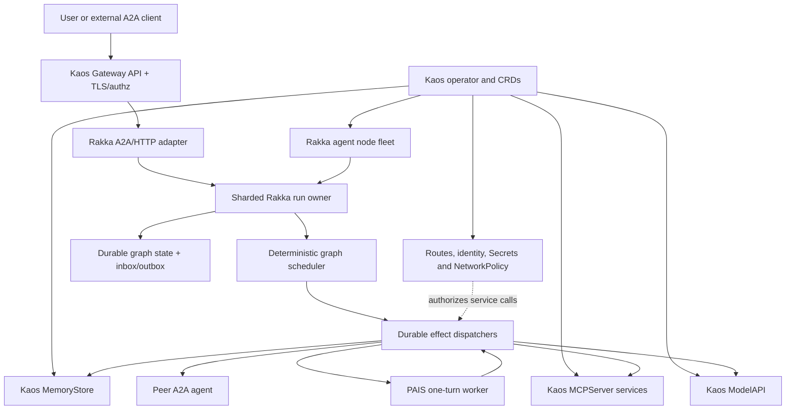

# Rakka and Kaos Technical Comparison

- Status: research evaluation
- Evaluation date: 2026-07-09
- Rakka snapshot: `22099130e5353983344d66d496ce1a70b900ff6d`
  (2026-07-09)
- Kaos snapshot: `edcd836d044f1797cce97f03836b05aa2745e53a`
  (2026-07-08), workspace version `0.6.1-dev`
- Latest Kaos release at evaluation time: `v0.6.0` (2026-07-08)

## Purpose

This document compares Rakka with
[`axsaucedo/kaos`](https://github.com/axsaucedo/kaos), with emphasis on:

1. Kaos' Kubernetes agent network versus Rakka multi-node clustering;
2. orchestration, reliability, and durability;
3. workflow and autonomous-loop semantics;
4. enterprise and Kubernetes readiness;
5. integrating the Kaos/Pydantic AI agent loop with Rakka;
6. integrating Kaos memory with a multi-node Rakka cluster; and
7. opportunities for a truly distributed cluster of autonomous agents.

The assessment distinguishes Kubernetes resource orchestration from durable
logical execution. It is based on the exact source snapshots above, public
documentation, and focused test runs. Kaos is moving quickly; pin and
revalidate the exact release used by an integration.

## Executive Summary

Kaos and Rakka are highly complementary because they operate at different
layers.

- **Kaos is a Kubernetes-native agent control plane and application platform.**
  Its operator reconciles `Agent`, `ModelAPI`, `MCPServer`, and `MemoryStore`
  custom resources into Deployments, Services, routes, storage, and optional
  security policy. Its Python agent server supplies Pydantic AI agent loops,
  A2A and OpenAI-compatible APIs, MCP tools, peer delegation, autonomous mode,
  memory integration, and telemetry.
- **Rakka is a distributed logical execution substrate.** It supplies typed
  actors, membership, private remoting, sharding, single-owner placement,
  revisioned persistence, durable inbox/outbox, deterministic compiled graph
  execution, recovery, passivation, drain, and Kubernetes lifecycle hooks.

Kaos' agent network is not a Rakka-equivalent multi-node cluster. It is a
declarative graph of Kubernetes services connected by HTTP/A2A. Kubernetes
restarts and reschedules the pods, but Kaos does not currently provide logical
task ownership, distributed task placement, a durable task queue, task-state
recovery, shard fencing, or workflow replay. Each `Agent` deployment is fixed
at one replica in the reviewed controller.

Kaos' operator orchestration and Rakka's orchestration are therefore not a
one-to-one comparison:

> Kaos reconciles desired infrastructure and service topology. Rakka owns the
> lifecycle of accepted logical work inside that topology.

The most promising ownership split is:

> Kaos owns CRDs, deployment, ModelAPI, MCPServer, MemoryStore, Gateway API,
> identity/policy integration, and the operator/UI experience. Rakka owns
> durable task and run identity, placement, graph state, recovery, timers, and
> effect delivery.

Do not use Kaos semantic memory as Rakka correctness state. Kaos' external
memory mode is a useful production-oriented domain memory service, but agent
task progress and durable effect state still belong in Rakka persistence.
Likewise, do not port the Python Pydantic AI server wholesale into a Rust actor.
Prefer a service adapter, a one-turn worker API, or a Rakka-backed implementation
of Kaos' `TaskManager` abstraction.

## Version and Maturity Baseline

The reviewed Kaos `main` branch identifies itself as `0.6.1-dev`, immediately
after the `v0.6.0` release. The project is Apache-2.0 licensed. At evaluation
time GitHub showed 23 releases, with `v0.6.0` published on 2026-07-08.

Kaos has substantial platform engineering for a pre-1.0 project:

- a Go `controller-runtime` operator and Helm chart;
- four `v1alpha1` CRDs;
- a CLI, UI, examples, and documentation site;
- separate non-root operator, agent, memory, and sync-service images;
- Gateway API integration and optional Envoy security policies;
- unit, integration, and kind-based end-to-end test suites; and
- OpenTelemetry support across key runtime paths.

It is nevertheless a young API surface. The CRDs are `v1alpha1`, conversion
webhooks are not implemented, and the release line is changing quickly. The
README's toolchain requirements are also behind the reviewed manifests: the
operator module declares Go `1.26.0`, and Python packages require Python 3.12,
while the README still says Go 1.21 and Python 3.11. Deployments should use the
requirements from the exact pinned release rather than the repository landing
page.

Rakka's workspace remains version `0.1.0` and describes itself as a v1
release-candidate foundation. Kaos is much further along as a Kubernetes-facing
agent platform. Rakka is much further along in durable logical execution,
ownership, and recovery. Neither alone is a complete enterprise agent product.

## Architectural Comparison

| Area | Kaos | Rakka |
| --- | --- | --- |
| Primary role | Kubernetes-native agent application/control plane | Distributed actor and durable workflow framework |
| Deployment model | Operator, Helm, CRDs, Deployments, Services, Gateway API | Library/runtime embedded in application pods, with Kubernetes lifecycle adapters and reference manifests |
| Agent runtime | Python PAIS/Pydantic AI server | Product-neutral Rust run/effect contracts and durable run owners |
| Distribution | Kubernetes service topology plus HTTP/A2A peer calls | Cluster membership, private remoting, receptionist, sharding, and logical ownership |
| Agent topology | `agentNetwork.access` allowlist injects named peer URLs | Actor refs/services and sharded identities independent of node location |
| Task state | In-process `LocalTaskManager` dictionary and asyncio tasks | Durable state, inbox/outbox, recovery, timers, and revision fencing |
| Workflows | LLM-driven delegation and autonomous loops across services | Deterministic durable compiled graph execution |
| Memory | Local ephemeral memory or central tiered `MemoryStore` | Application-owned semantic memory; persistence is reserved for correctness state |
| Model/tool plane | ModelAPI, LiteLLM/Ollama, MCPServer, Pydantic AI tools | Application dispatchers invoke external model/tool implementations as durable effects |
| Public protocols | A2A JSON-RPC, OpenAI-compatible HTTP, MCP, Gateway API | A2A and application HTTP/gRPC adapters; internal actor remoting is private |
| Security | Optional Gateway TLS, JWT, external authz, identity projection, NetworkPolicy | Trusted private remoting in v1; application/infrastructure supplies TLS, identity, and tenant policy |
| Kubernetes maturity | Strong operator, chart, CRDs, probes, routes, security integrations, E2E tests | Strong runtime drain/readiness/handoff semantics; no full agent operator/product control plane |
| Best fit | Describing and operating agent/model/tool/memory services | Keeping accepted work single-owned, durable, recoverable, and schedulable |

## 1. Kaos Agent Networks Versus a Rakka Multi-Node Cluster

### What Kaos Distributes

Kaos' operator turns custom resources into a Kubernetes service graph:

- an `Agent` becomes a PAIS Deployment and Service;
- a `ModelAPI` becomes a LiteLLM proxy or hosted Ollama service;
- an `MCPServer` becomes a tool service;
- a `MemoryStore` becomes a local persistent or externally backed memory
  service; and
- optional HTTPRoutes expose these services through Gateway API.

`Agent.spec.agentNetwork.access` names peer `Agent` resources. The controller
waits for dependencies, resolves peer Services, and injects peer endpoints into
the PAIS pod. The runtime presents each peer as a delegation tool and calls it
over HTTP using A2A `SendMessage`, with an OpenAI-compatible fallback.

This is real multi-pod and multi-node distribution. It provides a useful
declarative topology, lets Kubernetes place services across machines, and uses
ordinary service discovery and routing. It does not establish a distributed
agent-runtime cluster in Rakka's sense.

The reviewed Kaos implementation does not provide:

- an agent-node membership protocol;
- logical task identity independent of the serving pod;
- distributed task placement or rebalancing;
- a single-active-owner lease or fencing token;
- replicated or durable task state;
- ownership handoff during pod drain;
- a durable mailbox or accepted-work queue;
- split-brain handling for logical execution; or
- a versioned internal execution protocol with rolling compatibility policy.

The controller currently sets each Agent Deployment to one replica. A pod can
be restarted on another Kubernetes node, but the new process starts with empty
task state and no continuation of the interrupted autonomous loop.

### What Rakka Adds

Rakka supplies:

- incarnation-aware cluster membership and compatibility admission;
- bounded per-peer TCP/Protobuf remoting;
- receptionist discovery for actor services;
- stable sharded entity identities independent of pod location;
- shard allocation, passivation, handoff, and recovery;
- optional PostgreSQL coordinator leases and ownership fencing;
- durable inbox/outbox for deduplication, retry, and recovery; and
- Kubernetes readiness/drain behavior coordinated with ownership movement.

Rakka core remoting remains at-most-once. Work that cannot be lost requires the
durable inbox/outbox and idempotent or reconciled effects. Rakka v1 also does
not provide built-in TLS/mTLS or certificate lifecycle management; private
actor remoting must remain within trusted infrastructure.

See:

- [Rakka reliability boundaries](../../rakka-v1-reliability-boundaries.md)
- [Rakka compatibility policy](../../rakka-compatibility.md)
- [`rakka-sharding`](../../../crates/rakka-sharding/src/lib.rs)
- [`rakka-sharding-postgres`](../../../crates/rakka-sharding-postgres/src/lib.rs)
- [`rakka-workflow`](../../../crates/rakka-workflow/src/lib.rs)

### Are They Complementary?

Yes. The clean composition is:

- Kaos defines which agent, model, memory, and tool services should exist;
- Kubernetes schedules their pods and enforces infrastructure policy;
- Rakka assigns each logical run or entity to one active owner;
- Rakka recovers the run on another node after owner failure; and
- Kaos-managed ModelAPI, MCPServer, MemoryStore, and peer A2A endpoints become
  effect targets for that run.

Do not route Rakka's private actor-remoting connection through a normal
load-balanced Kubernetes Service. Use headless discovery or explicit peer
addresses for the Rakka node fleet. Use Kaos Gateway/A2A routing only at the
public or service protocol boundary.

### Protocol Details That Need Hardening

PAIS' agent card currently advertises a `localhost` URL, with a source TODO to
derive it from the request. Kaos' own `RemoteAgent` uses its configured service
URL rather than the card URL, so internal delegation can still work. External
A2A clients that trust the card URL may be misdirected.

The reviewed agent-card model also sets A2A protocol version `0.3.0`, while
some Kaos documentation describes A2A RC v1.0. An integration should pin the
actual schema, add contract tests at the Kaos/Rakka boundary, and treat
protocol-version changes as rolling-compatibility events.

## 2. Orchestration, Reliability, and Durability

Kaos' `openfang-kernel` equivalent is not one component. Its orchestration is
split across the Kubernetes operator and the PAIS process. Neither is a
one-to-one equivalent of Rakka's actor/workflow runtime.

| Concern | Kaos owner | Rakka owner | One-to-one? |
| --- | --- | --- | --- |
| Desired resources | Operator reconciliation | Application/deployment tooling | No; Kaos is stronger here |
| Dependency readiness | CRD status and controller requeue | Actor/service readiness and application policy | Partial |
| Pod/service placement | Kubernetes scheduler | Kubernetes scheduler for pods; Rakka sharding inside the fleet | Complementary |
| Agent reasoning loop | PAIS/Pydantic AI | External effect implementation | No |
| Task lifecycle | PAIS `TaskManager` | Durable run/entity state | Conceptual overlap, different guarantees |
| Run placement | Serving PAIS pod | Sharded logical owner | No |
| Accepted-work durability | None in local task manager | Durable inbox/run state | No |
| Retry | Model/tool/runtime-specific retries | Durable effect and outbox retry policy | Partial |
| Crash recovery | Kubernetes restarts process | State reload and deterministic continuation | No |
| External side effects | Direct tool/delegation calls | Durable effect intent plus dispatcher | Partial; neither can promise exactly once |
| Drain | Pod lifecycle and operator status | Coordinated ownership handoff/passivation | Complementary |

### Kaos Operator Reliability

The operator follows normal Kubernetes reconciliation patterns. It owns child
resources, checks dependencies, updates status, supports controller leader
election, and recreates drifted Deployments and Services. This is the correct
reliability model for infrastructure declarations.

It does not make application work durable. A reconciled `Agent` Deployment can
be healthy while an accepted task was lost by the previous pod. Kubernetes
desired state is not a task journal.

### PAIS Task Reliability

PAIS exposes a useful `TaskManager` abstract base class, but only
`LocalTaskManager` and `NullTaskManager` are implemented in the reviewed
source. `LocalTaskManager` keeps:

- tasks in an in-memory dictionary, capped at 10,000;
- running work in in-memory `asyncio.Task` handles;
- task history and event logs in process memory; and
- autonomous-loop progress in local variables.

Synchronous A2A requests transition through submitted, working, and terminal
states inline. Asynchronous/autonomous requests spawn background asyncio tasks.
Shutdown cancels running tasks. Pod restart loses task status, cancellation
state, event history, budgets, and loop position.

Kaos documentation explicitly identifies the local task list as ephemeral and
states that it does not survive pod restarts. This makes it suitable for
interactive and bounded work, not for durable acceptance of long-running
autonomous activity.

### The External-Effect Failure Window

Pydantic AI tools, MCP calls, and peer delegations are executed from the live
agent loop. A process can fail after a remote side effect succeeds but before
the task or memory update is accepted. Retrying the turn can repeat that
effect.

A Rakka integration should persist an effect intent before dispatch, use a
stable idempotency key, record the accepted result, and resume from durable run
state. This gives durable at-least-once delivery semantics. It still does not
make arbitrary external side effects exactly once; tool providers must be
idempotent or support reconciliation.

## 3. Workflow and Autonomous Execution Comparison

Kaos' "Agentic Graphs" and Rakka's compiled workflows use graph terminology
for different things.

### Kaos Workflows

Kaos provides three useful composition mechanisms:

1. **Agent-network topology.** `agentNetwork.access` declares which Agent
   services a caller may delegate to.
2. **LLM-driven hierarchy.** PAIS turns peer agents into tools, allowing a model
   to select and call them.
3. **Autonomous mode.** PAIS repeatedly runs toward a goal, optionally waiting
   between iterations. A2A async mode applies overall iteration/runtime/tool
   budgets; CRD-started autonomous mode deliberately runs without overall
   limits and applies only a per-iteration timeout.

These are valuable agent behaviors. They are not a persisted graph state
machine. There is no reviewed `Workflow` CRD, durable node-state ledger,
checkpoint/resume protocol, timer recovery, deterministic ready-node
scheduling, or durable compensation model.

### Rakka Workflows

Rakka's compiled workflow layer owns:

- a product-neutral immutable plan/IR;
- durable run and node state;
- deterministic graph scheduling;
- durable effect intent and result acceptance;
- retries, timers, cancellation, and recovery;
- passivation and node-drain behavior;
- query, retention, audit, metrics, tracing, and snapshots; and
- stable runtime events that are observability projections, not the
  correctness source.

See [`rakka-agent-workflow`](../../../crates/rakka-agent-workflow/src/lib.rs)
and the [compiled execution plans](../../plans/compiled_execution_with_graph_schdlr/).

### Recommended Combination

Treat Kaos' graph as **capability and connectivity topology** and Rakka's graph
as **execution topology**:

- an editor or Kaos CRD identifies agents, models, tools, memory bindings, and
  allowed delegation edges;
- a compiler resolves that declaration into Rakka's immutable runtime IR;
- Rakka schedules executable nodes and persists progress;
- Kaos-managed services perform model, MCP, memory, or peer-agent effects; and
- run status is projected back into Kaos status/UI for operators.

Do not let live service discovery mutate the meaning of an already accepted
workflow. Persist logical binding references and a plan version. Resolve the
current endpoint and credentials only at dispatch time.

## 4. Enterprise and Kubernetes Readiness

### Kubernetes Strengths

Kaos is well suited to Kubernetes relative to most agent SDKs. It already
provides:

- a Helm-packaged operator and generated CRDs;
- reconciliation of Deployments, Services, ConfigMaps, storage, and routes;
- dependency-aware readiness status;
- leader election for the operator;
- liveness/readiness probes and non-root images;
- local PVC-backed and external PostgreSQL/pgvector memory modes;
- two replicas and a PodDisruptionBudget by default for external MemoryStore;
- Gateway API HTTPRoutes and request timeout configuration;
- optional TLS using self-signed, cert-manager, or provided certificates;
- optional Envoy Gateway JWT and external authorization policy;
- agent/service identity projection through `kaos-sync` and AIB;
- optional gateway-routed internal calls and NetworkPolicy isolation;
- OpenTelemetry instrumentation; and
- kind-based end-to-end suites for major flows.

This is an important opportunity for Rakka: Kaos can supply much of the
operator, CRD, service, routing, and policy layer that Rakka intentionally does
not own.

### Enterprise Gaps and Risks

Kaos should not yet be described as generally enterprise-ready without a
qualified workload and hardening profile:

- version `0.6.x` and `v1alpha1` CRDs imply API and upgrade churn;
- conversion/admission webhooks are not implemented;
- each Agent is fixed at one replica and has no durable task backend;
- autonomous work cannot resume after pod loss;
- there is no durable workflow/effect queue;
- TLS, authentication, gateway-routed internal traffic, and NetworkPolicy
  isolation are optional and disabled by default;
- the main chart contains mutable tags such as `latest` or `main-stable` for
  some bundled dependencies; production installs should pin images by digest;
- external PostgreSQL is an operator dependency, not a database that Kaos
  operates or backs up;
- dynamic Python tools and custom MCP images run with the privileges of their
  pods and service accounts; Kubernetes isolation remains essential;
- A2A card/version details require compatibility testing; and
- exactly-once external effects are not provided.

The practical assessment is:

| Question | Assessment |
| --- | --- |
| Can Kaos be deployed on Kubernetes today? | Yes; Kubernetes is its primary deployment model. |
| Is the control plane production-shaped? | Yes, for carefully pinned and tested deployments. |
| Is it a stable enterprise API platform? | Not yet; it is pre-1.0 with `v1alpha1` APIs. |
| Are agent tasks durable across pod loss? | No, not with the supplied task managers. |
| Is external memory deployable in an HA shape? | Yes, with externally operated PostgreSQL/pgvector; background extraction still has a crash window. |
| Can security be enterprise-grade? | The necessary integration surfaces are promising, but must be explicitly enabled, configured, and validated. |

For production use, pin an exact release and image digests, enable Gateway TLS,
authentication/authorization, gateway routing and network isolation, use
external PostgreSQL/pgvector, enforce resource limits and restricted service
accounts, and run the full end-to-end/upgrade/security matrix in the target
Kubernetes distribution.

## 5. Can the Kaos Agent Loop Be Ported into Rakka?

Not as a direct Rust crate dependency. Kaos' agent runtime is Python, built on
FastAPI and Pydantic AI. A wholesale translation would be a rewrite and would
couple Rakka's product-neutral runtime to Pydantic AI internals.

There are four viable integration patterns.

### Option A: Invoke PAIS as a Service

Deploy PAIS through Kaos and invoke it from a Rakka effect dispatcher over A2A
or the OpenAI-compatible endpoint.

- Lowest integration cost.
- Preserves Kaos upgrades and Python model/tool ecosystem.
- Good for bounded, idempotent turns.
- Treating a whole autonomous run as one effect leaves intermediate tool calls
  outside Rakka's durable boundary.

Use this first for a proof of concept, but avoid long opaque effects.

### Option B: Expose a One-Turn Worker API

Refactor PAIS so one invocation performs one model decision and returns a
structured outcome:

- final answer;
- requested tool/delegation effects;
- proposed memory writes;
- usage/budget data; and
- opaque provider continuation data if required.

Rakka persists the outcome, dispatches each effect durably, records results,
and invokes the next turn. This provides the strongest separation: PAIS owns
reasoning, while Rakka owns orchestration and recovery.

### Option C: Implement a Rakka-Backed `TaskManager`

Kaos' `TaskManager` ABC is the clearest extension seam. A new implementation
could make PAIS' A2A routes clients of a Rakka-backed durable task service:

- `send_message` submits a stable command with an idempotency key;
- `submit_autonomous` starts a durable Rakka run;
- `get_task` and `list_tasks` query durable projections;
- `cancel_task` sends a revision-aware cancellation command; and
- `wait_for_completion` observes the durable run.

This can preserve the PAIS HTTP surface while moving task identity and state
out of the Python process. It does not by itself make the internal Pydantic AI
tool loop durable; combine it with Option B or route tools through Rakka.

### Option D: Reimplement Only Stable Contracts in Rust

If a pure-Rust runtime is required, port contracts, not framework internals:

- A2A task and agent-card models;
- structured model request/result models;
- tool/MCP request/result envelopes;
- budget and cancellation semantics; and
- memory/effect adapter interfaces.

Keep provider-specific behavior behind services or application adapters. This
avoids a permanent fork of PAIS while retaining wire compatibility.

### Recommendation

Start with Option A to prove Kaos deployment and service integration, then move
long-running workflows toward Options B and C. Do not place a persistent PAIS
event loop inside every Rakka actor; that creates two lifecycle owners and
makes recovery ambiguous.

## 6. Can Kaos Memory Be Used in a Multi-Node Rakka Agent Cluster?

Yes, but as **semantic/domain memory**, not as Rakka's correctness store.

### Local Memory

PAIS `LocalMemory` is an in-process bounded store, defaulting to 1,000 sessions
and 500 events per session. It disappears on restart. The reviewed source also
contains a TODO for locking concurrent get-or-create operations. It is suitable
for development, tests, and disposable sessions only.

### Remote `MemoryStore`

Kaos' central memory service is substantially stronger. It provides:

- short-term relational turn storage;
- a versioned medium-term digest produced by bounded folding;
- Mem0-based long-term/vector fact extraction;
- private, user, shared, and session scopes;
- server-side scope derivation in the current architecture;
- a local SQLite/Chroma/PVC mode;
- a production-oriented external PostgreSQL/pgvector mode;
- advisory locks for per-scope folding across replicas;
- multiple stateless service replicas and a PDB in external mode; and
- strict or fail-soft remote client behavior.

This is a good shared semantic memory service for sharded Rakka agents. The
Rakka entity identity and tenant context should be mapped to a stable Kaos
scope, while credentials are resolved at dispatch time.

### Reliability Boundaries

The memory service documents two important limits:

1. Long-term extraction, folding, and forgetting run in a bounded in-process
   background executor with retry and graceful drain, but there is no durable
   job queue. A crash can lose scheduled extraction work even when the
   short-term write survived.
2. In external mode the short-term PostgreSQL table is `UNLOGGED`, so a database
   crash recovery can truncate it. The medium-term digest is logged and
   durable.

The documentation also contains some version skew: the architecture page says
scope enforcement is server-side and fail-closed, while the component README
still describes fail-closed enforcement as future work. Validate the behavior
of the exact image selected.

### Required State Separation

| State | System of record | Reason |
| --- | --- | --- |
| Run status and current graph nodes | Rakka durable run state | Required for recovery and scheduling |
| Inbox deduplication and accepted commands | Rakka durable inbox | Required to avoid losing/reapplying commands |
| Effect intent, attempts, and accepted result | Rakka durable outbox/run state | Required for recoverable delivery |
| Timers, budgets, cancellation revision | Rakka durable run state | Required across owner changes |
| Conversation recency and summaries | Kaos MemoryStore | Agent context, not execution authority |
| Retrieved semantic facts | Kaos MemoryStore | Probabilistic/domain memory |
| Audit facts required for deterministic replay | Rakka artifact reference or run state | Retrieval results may change over time |

If crash-durable extraction is required, dispatch the extraction request from a
Rakka durable outbox or add a durable queue to Kaos MemoryStore. Persist the
accepted retrieval snapshot or artifact reference when later workflow behavior
must be reproducible.

Never store resolved credentials in a Rakka plan, graph state, outbox entry,
runtime event, metric, log, snapshot, or query index. Persist only logical
binding references and resolve secrets at dispatch.

## 7. High-Value Opportunities

### 1. A Kaos Runtime Profile for Rakka-Backed Agents

Add a runtime selector to `Agent`, or introduce a separate `RakkaAgent` or
`RakkaCluster` CRD. The operator would create:

- a Rakka node fleet with explicit private peer discovery;
- public A2A/HTTP adapter Services;
- readiness and drain wiring;
- required persistence and discovery bindings;
- PDB and rollout policy; and
- ModelAPI, MCPServer, MemoryStore, identity, and Gateway bindings.

Kaos would gain durable task execution without reimplementing a cluster
runtime. Rakka would gain a first-class operator and agent application model.

### 2. A Durable A2A Task Backend

Map A2A task IDs to sharded Rakka run IDs. Make A2A submission idempotent,
persist acceptance before returning, expose query/cancel through the run owner,
and project task events for clients. Keep event projections separate from the
durable correctness state.

This directly closes the largest current reliability gap in PAIS.

### 3. Kaos CRD-to-Rakka Workflow Compilation

Introduce a `Workflow`, `AgentPlan`, or deployment artifact that references
Kaos `Agent`, `ModelAPI`, `MCPServer`, and `MemoryStore` resources. A compiler
would emit versioned Rakka IR and logical credential bindings. Admission can
validate that dependencies and allowed delegation edges exist without
embedding live endpoints or secrets in the plan.

### 4. Durable Model, MCP, Memory, and Delegation Effects

Create Rakka dispatchers for:

- Kaos ModelAPI inference;
- MCPServer tool calls;
- MemoryStore recall/write/forget/extraction;
- peer A2A delegation; and
- PAIS one-turn reasoning.

Each effect should carry a stable effect ID, attempt number, timeout, tenant and
logical credential reference, and bounded observability labels. Services
should accept an idempotency key where possible.

### 5. Unified Drain and Rollout Safety

Have the Kaos operator use Rakka readiness and operational snapshots before a
rollout or pod termination:

1. mark the Rakka node draining;
2. stop new shard/run placement;
3. passivate or hand off owned work;
4. wait for durable effect checkpoints; and
5. allow Kubernetes termination only when safe or when the configured deadline
   expires.

Surface protocol incompatibility, persistence health, and remaining ownership
as Kaos status conditions.

### 6. Security-Layer Composition

Use Kaos Gateway API, JWT/external authorization, AIB identity projection, and
NetworkPolicy for public A2A and service effects. Keep Rakka remoting on a
separate private network protected by infrastructure or a service mesh. Do not
expose internal actor envelopes as a public agent protocol.

### 7. Durable Autonomous Goals

Translate a Kaos autonomous goal into a durable Rakka run with persisted:

- goal and plan revision;
- iteration, time, token, and tool budgets;
- next-wakeup timer;
- pending effects and accepted results;
- cancellation epoch; and
- terminal or suspended outcome.

This turns "keep an asyncio task alive" into "keep a goal recoverable until its
policy says to stop."

## Proposed Reference Architecture

The key rule is that no model response, memory retrieval, service endpoint, or
telemetry event becomes the execution source of truth. Rakka's durable run and
inbox/outbox state remains authoritative.

## Suggested Delivery Sequence

### Phase 1: Bounded Integration

- Pin a Kaos release and image digests.
- Deploy ModelAPI, MCPServer, and external MemoryStore through Kaos.
- Add Rakka effect adapters for those HTTP services.
- Invoke PAIS only for bounded, idempotent turns.
- Add A2A contract tests and fix the advertised agent-card URL/version boundary.

### Phase 2: Durable Task Ownership

- Map A2A tasks to Rakka sharded run IDs.
- Implement durable submit/query/cancel semantics.
- Add idempotency keys and durable effect result acceptance.
- Project Rakka run status into Kaos status/UI.
- Test kill/restart at every acceptance and dispatch boundary.

### Phase 3: Durable Agent Loop

- Add a PAIS one-turn API or structured loop adapter.
- Persist tool/delegation intents before execution.
- Recover budgets, timers, and continuation state after owner loss.
- Introduce a Kaos workflow/plan CRD that compiles to Rakka IR.

### Phase 4: Enterprise Hardening

- Add CRD conversion and upgrade policy.
- Add PDB, drain, rollout, compatibility, and persistence health conditions for
  Rakka fleets.
- Enable and test TLS, JWT/external authorization, gateway routing, and
  NetworkPolicy by default in the production profile.
- Validate backup/restore and disaster recovery for Rakka persistence and Kaos
  PostgreSQL/pgvector separately.
- Run failure injection, multi-node rebalancing, rolling upgrade, and security
  tests in the target Kubernetes distribution.

## Decision Matrix

| Requirement | Kaos alone | Rakka alone | Combined |
| --- | --- | --- | --- |
| Kubernetes agent/model/tool/memory CRDs | Strong | Not provided as a product control plane | Strong |
| Public A2A/OpenAI-compatible agent service | Strong | Adapter available; application wiring required | Strong |
| Pydantic AI and Python tool ecosystem | Strong | Not a core concern | Strong |
| Logical task ownership across pods | Weak | Strong | Strong |
| Durable autonomous progress | Weak | Strong substrate | Strong with loop decomposition |
| Durable graph execution | Weak | Strong | Strong |
| Shared semantic memory | Strong external mode | Adapter/application concern | Strong |
| Kubernetes routing and policy integration | Strong but opt-in | Infrastructure/application concern | Strong |
| Exactly-once external effects | No | No | No; use idempotency/reconciliation |
| Turnkey enterprise agent product | Not yet | No | Promising foundation, still requires integration and hardening |

## Validation Performed

At Kaos snapshot `edcd836d044f1797cce97f03836b05aa2745e53a`:

- `go test ./controllers ./pkg/...` in `operator`: passed;
- `uv run --frozen --extra dev pytest -q` in `pydantic-ai-server`:
  335 passed, 10 skipped;
- `uv run --frozen --extra dev --extra service --extra pydantic-ai pytest -q`
  in `kaos-memory`: 79 passed, 4 skipped; and
- `go test ./...` in `sync-service`: passed.

The full operator `go test ./...` compiled and passed the unit packages but
could not run its envtest integration suite because the local Kubebuilder
`etcd` binary was absent (`/usr/local/kubebuilder/bin/etcd`). The kind-based E2E
suite, real Gateway/Envoy/AIB integration, external PostgreSQL/pgvector,
multi-node failure behavior, and image build/deployment were not run in this
evaluation.

No Rakka code behavior was changed by this research-only document, so the full
Rakka validation suite was not run.

## Bottom Line

Kaos is not a substitute for Rakka's cluster, sharding, durable inbox/outbox,
or compiled execution engine. Rakka is not a substitute for Kaos' operator,
CRDs, ModelAPI/MCP/memory services, Gateway API integration, identity policy,
or Pydantic AI developer experience.

The combination is unusually compelling:

- **Kaos answers:** what agent services exist, how they are deployed, what
  models/tools/memory they may use, and how clients reach and authenticate to
  them.
- **Rakka answers:** who owns each accepted run, what durable step comes next,
  what effects are pending, and how work recovers after a node or pod fails.

The highest-value first milestone is a Kaos-managed Rakka agent runtime that
accepts one A2A task, assigns it to a sharded durable run owner, calls a
Kaos-managed ModelAPI and MCPServer, writes semantic context to MemoryStore,
and survives process termination at every boundary without losing accepted
work or repeating an idempotent effect. That proves the core architecture
before adding a workflow CRD or broader autonomous-agent features.

## Kaos Sources Reviewed

All source links below are pinned to the evaluated Kaos commit unless noted.

- [Kaos repository](https://github.com/axsaucedo/kaos)
- [Kaos releases](https://github.com/axsaucedo/kaos/releases)
- [Kaos documentation](https://axsaucedo.github.io/kaos/)
- [Repository README](https://github.com/axsaucedo/kaos/blob/edcd836d044f1797cce97f03836b05aa2745e53a/README.md)
- [Version marker](https://github.com/axsaucedo/kaos/blob/edcd836d044f1797cce97f03836b05aa2745e53a/VERSION)
- [Operator overview](https://github.com/axsaucedo/kaos/blob/edcd836d044f1797cce97f03836b05aa2745e53a/docs/operator/overview.md)
- [Agent CRD types](https://github.com/axsaucedo/kaos/blob/edcd836d044f1797cce97f03836b05aa2745e53a/operator/api/v1alpha1/agent_types.go)
- [Agent controller](https://github.com/axsaucedo/kaos/blob/edcd836d044f1797cce97f03836b05aa2745e53a/operator/controllers/agent_controller.go)
- [Operator entrypoint](https://github.com/axsaucedo/kaos/blob/edcd836d044f1797cce97f03836b05aa2745e53a/operator/main.go)
- [Helm chart values](https://github.com/axsaucedo/kaos/blob/edcd836d044f1797cce97f03836b05aa2745e53a/operator/chart/values.yaml)
- [Gateway API documentation](https://github.com/axsaucedo/kaos/blob/edcd836d044f1797cce97f03836b05aa2745e53a/docs/operator/gateway-api.md)
- [Security configuration](https://github.com/axsaucedo/kaos/blob/edcd836d044f1797cce97f03836b05aa2745e53a/operator/pkg/security/config.go)
- [PAIS server](https://github.com/axsaucedo/kaos/blob/edcd836d044f1797cce97f03836b05aa2745e53a/pydantic-ai-server/pais/server.py)
- [PAIS A2A and task manager](https://github.com/axsaucedo/kaos/blob/edcd836d044f1797cce97f03836b05aa2745e53a/pydantic-ai-server/pais/a2a.py)
- [PAIS remote-agent support](https://github.com/axsaucedo/kaos/blob/edcd836d044f1797cce97f03836b05aa2745e53a/pydantic-ai-server/pais/serverutils.py)
- [PAIS local memory](https://github.com/axsaucedo/kaos/blob/edcd836d044f1797cce97f03836b05aa2745e53a/pydantic-ai-server/pais/memory.py)
- [A2A task documentation](https://github.com/axsaucedo/kaos/blob/edcd836d044f1797cce97f03836b05aa2745e53a/docs/python-framework/a2a-tasks.md)
- [Autonomous execution documentation](https://github.com/axsaucedo/kaos/blob/edcd836d044f1797cce97f03836b05aa2745e53a/docs/python-framework/autonomous.md)
- [Memory architecture](https://github.com/axsaucedo/kaos/blob/edcd836d044f1797cce97f03836b05aa2745e53a/docs/operator/memory-architecture.md)
- [Memory store implementation](https://github.com/axsaucedo/kaos/blob/edcd836d044f1797cce97f03836b05aa2745e53a/kaos-memory/kaos_memory/stores.py)
- [Memory service background runner](https://github.com/axsaucedo/kaos/blob/edcd836d044f1797cce97f03836b05aa2745e53a/kaos-memory/kaos_memory/app.py)
- [Sync service](https://github.com/axsaucedo/kaos/tree/edcd836d044f1797cce97f03836b05aa2745e53a/sync-service)
- [Operator end-to-end tests](https://github.com/axsaucedo/kaos/tree/edcd836d044f1797cce97f03836b05aa2745e53a/operator/tests/e2e)
