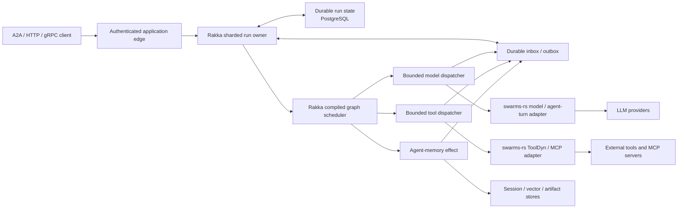

# Rakka and `swarms-rs` Technical Comparison

- Status: research evaluation
- Evaluation date: 2026-07-09
- Rakka snapshot: `1fcca9e49de5d690c557aaa6eac986020f74a21f`
  (2026-07-09)
- `swarms-rs` snapshot: `9d22ba91b15caf0d4133582d4e908b03972fe8e0`
  (2025-10-26), crate version `0.2.1`

## Purpose

This document compares Rakka with
[`The-Swarm-Corporation/swarms-rs`](https://github.com/The-Swarm-Corporation/swarms-rs),
with emphasis on:

1. distributed and multi-node execution;
2. orchestration, reliability, and durability;
3. workflow semantics;
4. enterprise and Kubernetes readiness;
5. integrating the `swarms-rs` agent loop with Rakka;
6. integrating `swarms-rs` persistence with a multi-node Rakka cluster; and
7. opportunities for a genuinely distributed cluster of autonomous agents.

The assessment distinguishes repository claims from behavior visible in the
reviewed source. `swarms-rs` is pre-1.0 and its repository has no published
GitHub release or tag at the evaluation date, so an integration should pin an
exact crate version and commit.

## Executive Summary

Rakka and `swarms-rs` are strongly complementary, but they operate at different
layers.

- `swarms-rs` is an application-facing agent SDK. It provides an agent loop,
  LLM providers, tool invocation, MCP clients, short-term conversation memory,
  agent traits, and convenient sequential, concurrent, DAG, rearrangement, and
  routing abstractions.
- Rakka is a distributed execution substrate. It provides typed actors,
  membership, remoting, sharded identity and placement, revision-fenced durable
  state, durable inbox/outbox, deterministic compiled graph execution,
  recovery, and Kubernetes lifecycle behavior.

The names can obscure this boundary: a `swarms-rs` “swarm” is a collection of
agent objects executing in one Rust process. The reviewed source does not
implement a peer protocol, cluster membership, remote placement, shard
ownership, distributed fencing, or failover. Its concurrent execution is Tokio
concurrency, not multi-node distribution.

The recommended composition is:

> Rakka owns durable run identity, placement, state transitions, recovery, and
> effect delivery. `swarms-rs` supplies agent-loop, model, tool, and MCP
> functionality behind Rakka dispatcher adapters.

Do not run the current `SwarmsAgent::run` unchanged as the correctness boundary
for effectful autonomous agents. It invokes tools inside the live agent future
and saves conversation state afterward. A crash after a tool succeeds but
before autosave can repeat the external effect. Refactor or adapt the loop so
model turns and tool calls cross Rakka's durable effect boundary.

## Version and Maturity Baseline

The reviewed `swarms-rs` manifest identifies version `0.2.1`, Rust edition 2024,
and an Apache-2.0 license. The same version is published on
[`docs.rs`](https://docs.rs/swarms-rs/latest/swarms_rs/), where 37.48% of the
crate is documented. The GitHub repository has no published releases or tags.
Its toolchain file selects `stable` rather than declaring a minimum supported
Rust version.

The repository describes the crate as production-ready, fault-tolerant,
distributed, and able to scale to very large agent counts. Those are not
demonstrated as distributed-system properties by the reviewed implementation.
They should be treated as product direction or performance aspirations until
supported by reproducible load tests, distributed failure tests, and explicit
delivery, ownership, and recovery semantics.

Rakka's crates are currently version `0.1.0`, and the repository describes
itself as a v1 release-candidate foundation. Rakka has substantially deeper
distributed reliability machinery, but it is also not a turnkey enterprise
agent platform. It deliberately leaves prompts, models, tools, credentials,
tenant policy, product APIs, and agent behavior to applications.

## Architectural Comparison

| Area | `swarms-rs` | Rakka |
| --- | --- | --- |
| Primary role | Agent and swarm SDK | Distributed actor and durable workflow framework |
| Deployment unit | Library embedded in one process | Cluster-aware application runtime |
| Agent execution | Complete LLM/tool loop | Product-neutral model/tool effect contracts and dispatchers |
| Distribution | In-process Tokio tasks | Membership, private remoting, sharding, ownership, and recovery |
| Workflows | Sequential, concurrent, DAG, rearrange, and router abstractions | Durable compiled graph execution with explicit waiting/effect states |
| State | In-memory maps plus JSON file save/load helpers | Revision-fenced durable state, event sourcing, PostgreSQL adapters, durable inbox/outbox |
| Failure model | Returned errors, local retries, timeouts, and process-local state | Actor supervision plus durable recovery across process/pod loss and shard movement |
| External effects | Tools execute directly inside the agent loop | Intent is persisted before dispatch; callbacks and retries are deduplicated |
| Agent memory | Conversation-oriented short memory; long-term query is unfinished | No opinionated semantic memory; provides persistence primitives for correctness state |
| Kubernetes | No working service or Kubernetes artifacts in the reviewed repository | Health, readiness, drain, handoff, compatibility, and multi-replica reference topology |
| Best fit | Defining and running agent behavior | Keeping long-running distributed work owned and recoverable |

## 1. Distributed Execution Versus a Rakka Multi-Node Cluster

There is no direct `swarms-rs` equivalent to either OpenFang Protocol or Rakka
cluster remoting in the reviewed source.

### What `swarms-rs` Provides

`swarms-rs` provides several forms of local concurrency:

- `ConcurrentWorkflow` runs cloned or borrowed agents concurrently through
  Tokio futures and channels;
- `SwarmsAgent::run_multiple_tasks` runs tasks with
  `for_each_concurrent(None, ...)`;
- tool calls can execute concurrently; and
- `DAGWorkflow` starts eligible downstream nodes concurrently.

These are useful single-process execution facilities. They do not provide:

- node discovery or membership;
- network transport for agent messages;
- logical agent location independent of process location;
- distributed placement or rebalancing;
- single-active-owner fencing;
- leader election or strongly consistent coordination;
- state replication or recovery on another machine;
- durable message acceptance;
- split-brain handling; or
- rolling protocol/schema compatibility.

The library does contain HTTP clients for model providers and MCP transports
for invoking external servers or child processes. Those are integrations with
services, not a peer-to-peer agent or cluster protocol.

Unbounded concurrency also appears in several paths. Passing `None` to
`for_each_concurrent` permits all available items to run concurrently. That is
not elastic cluster scaling and can create provider, memory, file-descriptor,
or downstream-service pressure inside one process.

### What Rakka Adds

Rakka supplies the missing distributed substrate:

- explicit node lifecycle and incarnation-aware membership;
- bounded Protobuf/TCP remoting between admitted peers;
- logical actor and entity identities independent of pod location;
- shard allocation, handoff, passivation, and recovery;
- optional PostgreSQL-backed coordinator leases and ownership fencing;
- etcd discovery as a strongly consistent external membership arbiter;
- fail-closed compatibility checks for rolling upgrades; and
- readiness and drain behavior coordinated with ownership movement.

See:

- [Rakka reliability boundaries](../../rakka-v1-reliability-boundaries.md)
- [Rakka compatibility policy](../../rakka-compatibility.md)
- [`rakka-sharding-postgres`](../../../crates/rakka-sharding-postgres/src/lib.rs)
- [`rakka-discovery-etcd`](../../../crates/rakka-discovery-etcd/src/lib.rs)

Rakka remoting is trusted internal cluster traffic. It is not an internet-facing
agent protocol and does not include built-in TLS/mTLS or certificate lifecycle
management in v1. Network policy, a private network, or a service mesh must
protect it.

### Recommended Combined Use

- Give every durable agent or run a stable Rakka entity identity.
- Let Rakka select the owning pod and recover the entity after failure.
- Execute `swarms-rs` model/tool functionality through bounded Rakka dispatcher
  workers.
- Use [`rakka-a2a`](../../../crates/rakka-a2a/src/lib.rs) or an application
  HTTP/gRPC API for cross-cluster and public agent communication.
- Do not create a second location registry in `swarms-rs`; resolve logical
  identity through Rakka sharding.

## 2. Orchestration, Reliability, and Durability

This is not a one-to-one comparison. `swarms-rs` has no kernel or distributed
orchestrator analogous to the combined Rakka runtime.

The closest `swarms-rs` composition consists of `SwarmsAgent`, implementations
of the `Agent` and `Swarm` traits, workflow structs, and `SwarmRouter`. These are
library abstractions inside an application process. Rakka divides distributed
responsibilities across actors, cluster membership, sharding, persistence,
workflow, and adapters.

| `swarms-rs` component | Closest Rakka component | Important difference |
| --- | --- | --- |
| `Agent` trait | Agent model/tool effect dispatcher interface | `Agent::run` is one opaque future; Rakka models durable step/effect boundaries |
| `SwarmsAgent` | Application agent-loop adapter | Rakka intentionally does not prescribe prompting or tool-selection logic |
| `Swarm` trait | Application workflow facade | It has no placement, recovery, or delivery semantics |
| `SwarmRouter` | Ingress/compiler routing policy | Rakka route selection ultimately resolves durable run/entity ownership |
| `DAGWorkflow` | Compiled graph scheduler | The former is in-memory live execution; the latter persists graph state and waiting transitions |
| File persistence | Persistence adapter | Rakka adapters use revision/CAS and durable inbox/outbox invariants |
| Tokio concurrency | Dispatcher fleet and shard distribution | Rakka bounds and distributes execution; concurrency alone does not add ownership |
| Short memory | Agent-domain session store | Rakka persistence is correctness state, not a semantic-memory product |

### `swarms-rs` Agent-Loop Semantics

The current `SwarmsAgent::run` implementation:

1. adds the task to an in-memory conversation map;
2. optionally asks the model to plan;
3. optionally autosaves conversation JSON;
4. loops up to `max_loops`;
5. retries failed model/chat turns up to `retry_attempts`;
6. executes model-requested tools inside `chat`;
7. adds model/tool results to conversation memory; and
8. autosaves again after a successful loop and at the end.

This is a useful autonomous-loop implementation, but its retries and autosave
are not durable workflow semantics:

- tool effects happen before the subsequent conversation save;
- the file write is not a transaction with the external effect;
- there is no durable outbox or idempotency ledger;
- after all attempts fail, the outer loop breaks and the method returns the
  current conversation as `Ok`, so callers cannot reliably distinguish retry
  exhaustion from successful completion;
- successful concurrent-agent results are collected while agent errors are
  logged and omitted in some batch/concurrent paths; and
- long-term-memory retrieval is declared on the trait but the concrete method
  is `unimplemented!`, while its calls in the main loop are commented out.

The central failure window is:

```text
model requests tool -> tool changes external system -> process dies -> no save
                                                        |
restart/retry -------------------------------------------+
                                                        v
                                                tool may run again
```

Rakka does not claim exactly-once external effects either. It closes more of
this window by durably recording effect intent, assigning an idempotency key,
leasing delivery, and durably accepting/deduplicating completion. The external
service must still be idempotent or the application must reconcile/compensate.

### Persistence Semantics

The `swarms-rs` persistence module supplies general file helpers:

- overwrite a file with `tokio::fs::write`;
- append bytes;
- read bytes; and
- zstd compress/decompress.

Agent autosave serializes a task's conversation to a filename derived from the
lower 32 bits of a task hash. Sequential and concurrent workflows write
execution metadata only after their live execution finishes.

The reviewed persistence layer does not implement:

- atomic temp-file-and-rename commits;
- `fsync` durability;
- revisions, compare-and-swap, or fencing;
- transactions;
- schema migration/versioning;
- multi-process locking;
- durable inbox/outbox;
- callback deduplication;
- a shared database backend; or
- an agent resume/recovery protocol using the saved state.

The files are useful for logs, metadata, examples, and best-effort checkpoints.
They must not be treated as the correctness store for a multi-node cluster.

### Rakka's Reliability Boundary

Rakka's default core messages and remoting are at-most-once. Stronger behavior
is opt-in and composed from:

- revision-fenced durable state or event sourcing;
- durable inbox acceptance and deduplication;
- durable outbox intent, leases, retries, and recovery;
- stable idempotency keys;
- sharded single-owner execution with fencing; and
- application-level idempotency or reconciliation for external effects.

The comparison is therefore not “Rakka retries more.” It is that Rakka makes
acceptance, state transition, effect intent, delivery attempt, and callback
acceptance explicit recoverable states.

## 3. Workflow Comparison

`swarms-rs` workflows are convenient live agent compositions. Rakka workflows
are durable distributed state machines.

| Capability | `swarms-rs` | Rakka |
| --- | --- | --- |
| Authoring | Rust builders and rearrangement flow strings | Compiled product-neutral execution plan |
| Shapes | Sequential, concurrent, DAG, rearrange, router | DAG dependencies, fan-out/fan-in, branches, bounded iterators, waits, cancellation, terminal states |
| Execution | Direct `Agent::run` futures | Pure scheduler transitions plus durable external effects |
| State | In-memory maps/graphs and post-run JSON metadata | Durable run, node, effect, retry, timer, and checkpoint state |
| Restart recovery | No workflow checkpoint/resume protocol visible | Recovery after acceptance, dispatch, callback, passivation, and shard movement |
| Error handling | Rust errors; some concurrent/DAG errors are logged or retained in result maps | Explicit durable failure, retry, exhaustion, cancellation, and terminal transitions |
| Timeouts | DAG node timeout fixed at five minutes | Durable timers and dispatcher leases with configurable policy |
| Distribution | One process | Sharded run ownership and dispatcher fleets across cluster nodes |
| External effects | Called directly by agents | Intent persisted before dispatch; completion deduplicated |
| Long waits | A live future must remain | Durable timers and human checkpoints release live execution resources |

### Specific `swarms-rs` Workflow Behavior

- `SequentialWorkflow` passes each agent's output to the next agent and writes
  metadata after all agents finish.
- `ConcurrentWorkflow` invokes all agents concurrently. Individual agent
  failures are logged and omitted, so a returned conversation can represent a
  partial fan-out without an aggregate failure.
- `DAGWorkflow` uses `petgraph`, conditions, transformations, input aggregation,
  and a five-minute node timeout. Downstream execution errors are logged inside
  joined futures rather than propagated to the original caller. The reviewed
  reset path also locks the same node result mutex twice before releasing the
  first guard, which can stall `execute_workflow`; this should be revalidated
  against any later commit before adoption.
- `AgentRearrange` parses an approachable flow string for sequential and
  concurrent patterns, with optional metadata autosave.
- `SwarmRouter` chooses among local workflow implementations; it is not a
  distributed location router.

### Workflow Compiler Opportunity

The authoring API is one of the best integration opportunities. Treat
`swarms-rs` workflow types as an application DSL and compile them into Rakka's
durable graph IR:

| `swarms-rs` construct | Rakka compiled form |
| --- | --- |
| `SequentialWorkflow` | Linear dependency chain |
| `ConcurrentWorkflow` | Fan-out followed by explicit join/fan-in policy |
| `DAGWorkflow` node and edge | Durable graph node and dependency/branch |
| Edge condition | Pure branch decision with persisted input/output reference |
| Edge transform | Deterministic local transform or explicit effect if impure |
| `AgentRearrange` flow string | Application-owned source DSL compiled and validated before deployment |
| `SwarmRouter` | Ingress selection of a versioned compiled plan |
| Agent call | Durable model/agent effect |
| Tool call | Durable tool effect with stable idempotency key |

Compilation must reject ambiguous joins, cycles, unknown agents, unbounded
parallelism, unbounded output, and non-deterministic transforms. The compiled
plan should store logical model, tool, and credential binding references—not
resolved credentials or prompts containing secrets.

See Rakka's
[compiled graph execution specification](../../plans/compiled_execution_with_graph_schdlr/compiled-execution-with-graph-scheduler-spec.md)
and [agent workflow specification](../../plans/agentic-workflow/agentic-workflow-spec.md).

## 4. Enterprise and Kubernetes Readiness

### `swarms-rs` Assessment

The library has useful engineering foundations:

- Rust memory safety and async concurrency;
- a conventional typed agent/tool API;
- several model-provider adapters;
- MCP child-process and SSE integration;
- unit, workflow, benchmark, lint, documentation, coverage, audit, and
  dependency-policy automation in the repository; and
- a non-root user in its intended runtime container stage.

Those foundations do not establish enterprise readiness for a distributed
service. Important gaps in the reviewed repository include:

- no server binary or daemon entry point in the `swarms-rs` package;
- no authentication, authorization, tenant isolation, quota, or admission
  layer around agent execution;
- no cluster membership, distributed ownership, or failover;
- no shared durable database backend;
- no Kubernetes manifests, Helm chart, operator, probes, drain hook, Pod
  Disruption Budget, or NetworkPolicy;
- no published GitHub release/tag for source-to-artifact traceability;
- no declared MSRV; and
- no documented delivery or recovery guarantees.

The supplied Dockerfile does not currently demonstrate a runnable image:

- it builds a library workspace and then expects a `swarms-rs` executable;
- its `COPY` instructions include shell redirection and `|| true`, syntax that
  is not executed by Docker's `COPY` instruction;
- it uses a Rust 1.80 builder while the crate requests edition 2024, which was
  stabilized in Rust 1.85; and
- its default command points to `./bin/swarms-rs`, although the reviewed crate
  does not define that binary.

The repository's current workspace test command also fails during dependency
resolution: `examples/binance-tools` requests `rmcp` feature
`transport-sse-server`, which the resolved dependency does not expose. This is
a snapshot-specific reproducibility issue, not proof that the published
library cannot be used independently.

**Conclusion:** `swarms-rs` is suitable for prototyping and as a component in a
service whose owner supplies the missing operational controls. The reviewed
source does not substantiate a claim that it is itself an enterprise-ready,
horizontally scalable, fault-tolerant agent platform.

### Rakka Assessment

Rakka is more Kubernetes- and distributed-systems-ready:

- readiness, liveness, drain, and coordinated shutdown surfaces;
- shard handoff/passivation and fail-closed compatibility;
- multi-replica StatefulSet/service/PDB/reference configuration;
- bounded mailboxes, remoting queues, workflows, and dispatchers;
- PostgreSQL and etcd adapters; and
- operational metrics and snapshots.

See the
[Kubernetes agent workflow topology](../../plans/agentic-workflow/kubernetes-reference-topology.md).

Rakka still requires production hardening and application ownership. Its v1
limitations include no built-in TLS/mTLS, certificate lifecycle, Helm chart or
operator, multi-region consensus, or exactly-once external side effects. The
agent product must supply authentication, authorization, tenant policy,
credential storage/resolution, API rate limits, provider budgets, and prompt
and tool safety controls.

### Kubernetes Deployment Recommendation

Do not deploy the `swarms-rs` library directly. Build an application service:

1. a Rakka node binary with health, readiness, drain, metrics, and stable
   configuration;
2. a `rakka-swarms` adapter crate that invokes selected `swarms-rs` components;
3. external PostgreSQL for correctness state and optionally an agent-memory
   store;
4. etcd or another supported discovery mode for multi-node ownership;
5. Kubernetes NetworkPolicy and a mesh/sidecar or application TLS for private
   remoting; and
6. workload identity or a secrets manager resolving logical credential
   bindings only at dispatch time.

## 5. Can the `swarms-rs` Agent Loop Be Ported into Rakka?

Yes. This is technically easier than porting a tightly coupled daemon kernel,
because `swarms-rs` is already a Rust library with a relatively small `Agent`
trait. The right target is an adapter and a controlled refactor, not copying
the whole loop into an actor handler.

### Integration Options

#### Option A: Wrap a Whole Agent Run

Implement a Rakka dispatcher that calls `Agent::run(task)` and returns its
result as one effect completion.

Use this only when:

- the loop is short and bounded;
- all tools are read-only or safely idempotent;
- cancellation and timeout are enforced outside the loop;
- duplicate execution is acceptable; and
- losing intra-loop progress is acceptable.

This option provides distributed placement and recovery of the enclosing run,
but it does not make internal tool calls durable.

#### Option B: Split the Loop at Effect Boundaries

This is the recommended production design. Refactor the loop into resumable
operations such as:

```rust
enum AgentTurn {
    RequestModel(ModelTurnRequest),
    RequestTool(ToolCallRequest),
    AcceptToolResult(ToolCallResult),
    Complete(AgentOutput),
    Fail(AgentFailure),
}
```

Rakka persists the run state and effect intent before a dispatcher calls the
model or tool. The dispatcher may reuse `swarms-rs` provider, tool, and MCP
implementations. Its callback carries the run id, node id, attempt, effect id,
and idempotency key. The run owner accepts it once, advances deterministically,
and schedules the next turn.

### Required Adaptation Work

- Separate model inference from tool execution in `SwarmsAgent::chat`.
- Make the loop state serializable and explicitly versioned.
- Replace task-text-derived file identity with stable Rakka run/entity ids.
- Represent retry exhaustion as an explicit failure, not an `Ok` conversation.
- Add bounded model, tool, and batch concurrency.
- Propagate partial and aggregate failures according to compiled policy.
- Move timeouts and retry schedules into durable Rakka state.
- Make cancellation cooperative at every model/tool boundary.
- Resolve credentials only inside dispatchers and never persist resolved secret
  material.
- Define maximum prompt, tool result, artifact, and conversation sizes.

Do not block an actor mailbox while an autonomous loop performs network calls.
The actor or sharded run owner should perform small deterministic transitions;
dispatcher tasks perform external I/O and report completion back durably.

## 6. Can `swarms-rs` Persistence Be Used in a Multi-Node Rakka Cluster?

The domain model can be reused, but the current file persistence should not be
used as the cluster correctness store.

### What Can Be Reused

- conversation and message schemas, after adding schema versions;
- agent configuration with secret fields replaced by logical bindings;
- compressed artifact helpers for bounded blobs;
- workflow metadata as an observability projection; and
- short-memory behavior behind a new storage abstraction.

### What Must Be Replaced or Added

Introduce application-owned interfaces such as:

```rust
trait AgentSessionStore {
    async fn load(&self, agent_id: &str, session_id: &str)
        -> Result<VersionedSession, StoreError>;

    async fn compare_and_set(
        &self,
        expected_revision: u64,
        next: VersionedSession,
    ) -> Result<u64, StoreError>;
}

trait AgentMemoryStore {
    async fn search(&self, query: MemoryQuery)
        -> Result<Vec<MemoryHit>, StoreError>;

    async fn append(&self, entry: MemoryEntry)
        -> Result<MemoryRef, StoreError>;
}
```

Back session/correctness data with PostgreSQL or another store that supports
transactions, revisions, and fencing. A vector database or object store can
hold semantic memory and large artifacts, but references and committed
versions should be recorded durably with the run.

Keep two kinds of state separate:

- **Correctness state:** run status, current node, accepted input, attempts,
  pending effects, timers, cancellation, and callback deduplication. Rakka owns
  this.
- **Agent-domain memory:** conversation history, summaries, embeddings,
  retrieved documents, plans, and artifacts. The application/agent memory
  service owns this.

Memory retrieval is an external effect when it can change independently. Store
the accepted retrieval result or immutable artifact reference with the run if
recovery must reproduce the same decision. Do not assume that repeating a
vector search will return the same results.

## 7. High-Value Opportunities

### 7.1 `rakka-swarms` Adapter Crate

Create a feature-gated adapter rather than adding `swarms-rs` dependencies to
Rakka core. It should provide:

- model-turn dispatch through `swarms-rs` model implementations;
- tool dispatch through `ToolDyn` and MCP clients;
- stable request/result envelopes;
- timeout, cancellation, concurrency, and response-size limits;
- logical credential binding resolution;
- bounded telemetry with no prompts, raw tool results, or secrets as metric
  labels; and
- error classification into retryable, permanent, cancelled, and policy
  failures.

### 7.2 Durable `SwarmsAgent`

Build a resumable driver around `SwarmsAgent` behavior. Persist turn number,
accepted conversation reference, completion decision, pending effect, and
budget counters. Allow passivation between turns so thousands of logical agents
do not require thousands of live Tokio tasks.

### 7.3 Workflow Compiler

Compile `SequentialWorkflow`, `ConcurrentWorkflow`, `DAGWorkflow`, and
`AgentRearrange` definitions into versioned Rakka plans. This preserves the
friendly SDK while adding validation, durable joins, retries, recovery,
cancellation, and shard movement.

### 7.4 Distributed Agent Identity and Placement

Map `(tenant, agent, session/run)` to stable Rakka entity ids. Rakka sharding
then provides one active owner, placement, passivation, handoff, and recovery.
The `Agent` object becomes behavior available to dispatcher workers rather than
the location authority.

### 7.5 Durable Tool Gateway

Wrap `ToolDyn` and MCP calls in a gateway that requires:

- declared capability and effect class;
- input/output schemas and size limits;
- stable idempotency keys;
- provider/tool timeout and concurrency policy;
- audit references without secret payloads; and
- optional reconciliation or compensation handlers.

Tools that cannot provide idempotency should be explicitly marked and limited
to at-most-once-attempt or human-confirmed policies; no framework can infer
exactly-once semantics for an arbitrary external API.

### 7.6 Public Agent Interoperability

Expose selected sharded agents through Rakka A2A. Map an A2A task to a durable
run and dispatch its model/tool work through the `swarms-rs` adapter. This adds
network-facing agent interoperability without inventing a second internal
cluster transport.

### 7.7 Shared Agent Memory Service

Finish the long-term-memory abstraction behind a multi-tenant service with
versioned sessions, immutable artifact references, retention, deletion,
encryption, and retrieval audit. Treat its responses as workflow effects, not
as Rakka's primary correctness state.

### 7.8 Kubernetes Agent Runtime

Package the combined application with Rakka's readiness and drain semantics.
Use separate bounded dispatcher pools for models, tools, MCP child processes,
and memory access so provider slowness or tool storms do not exhaust actor
mailboxes or cluster-remoting capacity.

## Proposed Combined Architecture



Rakka cluster traffic remains private. The application edge owns public
authentication and tenant policy. Dispatcher workers resolve credentials at
the last responsible moment. Durable state contains only logical credential
references and bounded result/artifact references.

## Recommended Delivery Plan

### Phase 1: Prove One Durable Agent Turn

- Add a separate `rakka-swarms` integration crate.
- Run one sharded agent/session identity.
- Dispatch one model turn through a `swarms-rs` provider.
- Persist and deduplicate completion.
- Enforce timeout, cancellation, and bounded concurrency.

### Phase 2: Prove One Effectful Tool

- Extract tool invocation from inside the opaque loop.
- Persist tool intent before execution.
- Require a stable idempotency key.
- Kill the process before dispatch, during dispatch, after the external effect,
  and before callback acceptance; and
- Verify recovery never loses accepted work and does not duplicate a correctly
  idempotent external effect.

### Phase 3: Compile a Workflow

- Compile a sequential flow, then a fan-out/fan-in flow.
- Make join policy explicit: all, quorum, first-success, or best-effort.
- Recover after pod death at every node/effect boundary.
- Add durable cancellation and retry exhaustion.

### Phase 4: Add Memory and Kubernetes Operations

- Add versioned shared session and semantic-memory adapters.
- Deploy at least three Rakka nodes with PostgreSQL and discovery.
- Exercise readiness, drain, shard handoff, rolling compatibility, and stale
  callback rejection; and
- Add network policy, workload identity, resource limits, PDB, and SLO-backed
  telemetry.

## Go/No-Go Criteria

Proceed with an integration if the objective is to combine `swarms-rs` agent
developer ergonomics with Rakka distributed correctness. Do not proceed by
merely running the unmodified loop in many pods and sharing a filesystem.

Before production use, require evidence that:

- every accepted run has exactly one fenced logical owner;
- every external effect has an explicit delivery and idempotency policy;
- pod death at every transition has a tested recovery outcome;
- workflow joins and partial failures have explicit semantics;
- concurrency is bounded per tenant, provider, tool, node, and cluster;
- prompts, tool results, and credentials cannot leak through logs or metrics;
- schema and plan versions support N/N+1 rolling compatibility;
- state retention/deletion satisfies tenant and compliance requirements; and
- the application service, container, and Kubernetes manifests are built and
  tested independently of the upstream example Dockerfile.

## Bottom Line

`swarms-rs` is best viewed as an agent behavior SDK, not as a distributed agent
cluster. Rakka is best viewed as the durable distributed substrate, not as the
agent intelligence layer.

The highest-value combination is not to merge their runtimes wholesale. It is
to:

1. retain `swarms-rs` agent, model, tool, MCP, and authoring ergonomics;
2. expose model and tool work as explicit resumable effects;
3. compile its workflow descriptions into Rakka's durable graph runtime;
4. use Rakka for identity, ownership, placement, recovery, and Kubernetes
   lifecycle; and
5. store agent memory in a shared versioned service while keeping Rakka durable
   run state as the correctness source.

That separation creates a credible path from an in-process swarm SDK to a
multi-node cluster of autonomous agents without overstating the delivery or
exactly-once guarantees of either project.

## Sources Reviewed

### `swarms-rs`

- [Repository and README](https://github.com/The-Swarm-Corporation/swarms-rs)
- [Published crate documentation](https://docs.rs/swarms-rs/latest/swarms_rs/)
- [Crate manifest at the reviewed commit](https://github.com/The-Swarm-Corporation/swarms-rs/blob/9d22ba91b15caf0d4133582d4e908b03972fe8e0/swarms-rs/Cargo.toml)
- [`SwarmsAgent` implementation](https://github.com/The-Swarm-Corporation/swarms-rs/blob/9d22ba91b15caf0d4133582d4e908b03972fe8e0/swarms-rs/src/agent/swarms_agent.rs)
- [`Agent` trait and configuration](https://github.com/The-Swarm-Corporation/swarms-rs/blob/9d22ba91b15caf0d4133582d4e908b03972fe8e0/swarms-rs/src/structs/agent.rs)
- [Persistence helpers](https://github.com/The-Swarm-Corporation/swarms-rs/blob/9d22ba91b15caf0d4133582d4e908b03972fe8e0/swarms-rs/src/structs/persistence.rs)
- [Sequential workflow](https://github.com/The-Swarm-Corporation/swarms-rs/blob/9d22ba91b15caf0d4133582d4e908b03972fe8e0/swarms-rs/src/structs/sequential_workflow.rs)
- [Concurrent workflow](https://github.com/The-Swarm-Corporation/swarms-rs/blob/9d22ba91b15caf0d4133582d4e908b03972fe8e0/swarms-rs/src/structs/concurrent_workflow.rs)
- [DAG workflow](https://github.com/The-Swarm-Corporation/swarms-rs/blob/9d22ba91b15caf0d4133582d4e908b03972fe8e0/swarms-rs/src/structs/graph_workflow.rs)
- [Agent rearrangement workflow](https://github.com/The-Swarm-Corporation/swarms-rs/blob/9d22ba91b15caf0d4133582d4e908b03972fe8e0/swarms-rs/src/structs/rearrange.rs)
- [Swarm router](https://github.com/The-Swarm-Corporation/swarms-rs/blob/9d22ba91b15caf0d4133582d4e908b03972fe8e0/swarms-rs/src/structs/swarms_router.rs)
- [Tool abstraction](https://github.com/The-Swarm-Corporation/swarms-rs/blob/9d22ba91b15caf0d4133582d4e908b03972fe8e0/swarms-rs/src/structs/tool.rs)
- [Dockerfile](https://github.com/The-Swarm-Corporation/swarms-rs/blob/9d22ba91b15caf0d4133582d4e908b03972fe8e0/Dockerfile)
- [Continuous integration workflow](https://github.com/The-Swarm-Corporation/swarms-rs/blob/9d22ba91b15caf0d4133582d4e908b03972fe8e0/.github/workflows/ci.yml)
- [Security workflow](https://github.com/The-Swarm-Corporation/swarms-rs/blob/9d22ba91b15caf0d4133582d4e908b03972fe8e0/.github/workflows/security.yml)
- [GitHub tags](https://github.com/The-Swarm-Corporation/swarms-rs/tags)

### Rakka

- [Rakka overview](../../../README.md)
- [Rakka actor framework specification](../../rakka-actor-framework-spec.md)
- [Rakka reliability boundaries](../../rakka-v1-reliability-boundaries.md)
- [Rakka known limitations](../../rakka-v1-known-limitations-roadmap.md)
- [Rakka compatibility policy](../../rakka-compatibility.md)
- [Agent workflow specification](../../plans/agentic-workflow/agentic-workflow-spec.md)
- [Compiled graph execution specification](../../plans/compiled_execution_with_graph_schdlr/compiled-execution-with-graph-scheduler-spec.md)
- [Kubernetes reference topology](../../plans/agentic-workflow/kubernetes-reference-topology.md)
- [`rakka-agent-workflow`](../../../crates/rakka-agent-workflow/src/lib.rs)
- [`rakka-a2a`](../../../crates/rakka-a2a/src/lib.rs)
- [`rakka-sharding-postgres`](../../../crates/rakka-sharding-postgres/src/lib.rs)
- [`rakka-discovery-etcd`](../../../crates/rakka-discovery-etcd/src/lib.rs)
